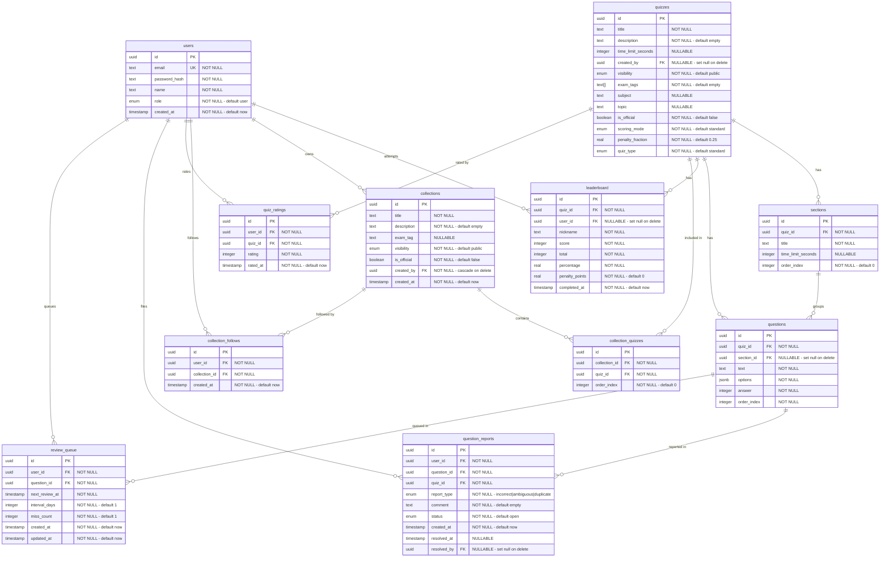

# Entity Relationship Diagram

```mermaid
erDiagram
    users {
        uuid id PK
        text email UK "NOT NULL"
        text password_hash "NOT NULL"
        text name "NOT NULL"
        enum role "NOT NULL - default user"
        timestamp created_at "NOT NULL - default now"
    }

    quizzes {
        uuid id PK
        text title "NOT NULL"
        text description "NOT NULL - default empty"
        integer time_limit_seconds "NULLABLE"
        uuid created_by FK "NULLABLE - set null on delete"
        enum visibility "NOT NULL - default public"
        text[] exam_tags "NOT NULL - default empty"
        text subject "NULLABLE"
        text topic "NULLABLE"
        boolean is_official "NOT NULL - default false"
        enum scoring_mode "NOT NULL - default standard"
        real penalty_fraction "NOT NULL - default 0.25"
        enum quiz_type "NOT NULL - default standard"
    }

    sections {
        uuid id PK
        uuid quiz_id FK "NOT NULL"
        text title "NOT NULL"
        integer time_limit_seconds "NULLABLE"
        integer order_index "NOT NULL - default 0"
    }

    questions {
        uuid id PK
        uuid quiz_id FK "NOT NULL"
        uuid section_id FK "NULLABLE - set null on delete"
        text text "NOT NULL"
        jsonb options "NOT NULL"
        integer answer "NOT NULL"
        integer order_index "NOT NULL"
    }

    leaderboard {
        uuid id PK
        uuid quiz_id FK "NOT NULL"
        uuid user_id FK "NULLABLE - set null on delete"
        text nickname "NOT NULL"
        integer score "NOT NULL"
        integer total "NOT NULL"
        real percentage "NOT NULL"
        real penalty_points "NOT NULL - default 0"
        timestamp completed_at "NOT NULL - default now"
    }

    collections {
        uuid id PK
        text title "NOT NULL"
        text description "NOT NULL - default empty"
        text exam_tag "NULLABLE"
        enum visibility "NOT NULL - default public"
        boolean is_official "NOT NULL - default false"
        uuid created_by FK "NOT NULL - cascade on delete"
        timestamp created_at "NOT NULL - default now"
    }

    collection_quizzes {
        uuid id PK
        uuid collection_id FK "NOT NULL"
        uuid quiz_id FK "NOT NULL"
        integer order_index "NOT NULL - default 0"
    }

    collection_follows {
        uuid id PK
        uuid user_id FK "NOT NULL"
        uuid collection_id FK "NOT NULL"
        timestamp created_at "NOT NULL - default now"
    }

    quiz_ratings {
        uuid id PK
        uuid user_id FK "NOT NULL"
        uuid quiz_id FK "NOT NULL"
        integer rating "NOT NULL"
        timestamp rated_at "NOT NULL - default now"
    }

    question_reports {
        uuid id PK
        uuid user_id FK "NOT NULL"
        uuid question_id FK "NOT NULL"
        uuid quiz_id FK "NOT NULL"
        enum report_type "NOT NULL - incorrect|ambiguous|duplicate"
        text comment "NOT NULL - default empty"
        enum status "NOT NULL - default open"
        timestamp created_at "NOT NULL - default now"
        timestamp resolved_at "NULLABLE"
        uuid resolved_by FK "NULLABLE - set null on delete"
    }

    review_queue {
        uuid id PK
        uuid user_id FK "NOT NULL"
        uuid question_id FK "NOT NULL"
        timestamp next_review_at "NOT NULL"
        integer interval_days "NOT NULL - default 1"
        integer miss_count "NOT NULL - default 1"
        timestamp created_at "NOT NULL - default now"
        timestamp updated_at "NOT NULL - default now"
    }

    quizzes ||--o{ sections : "has"
    quizzes ||--o{ questions : "has"
    sections ||--o{ questions : "groups"
    quizzes ||--o{ leaderboard : "has"
    users ||--o{ leaderboard : "attempts"
    users ||--o{ collections : "owns"
    collections ||--o{ collection_quizzes : "contains"
    quizzes ||--o{ collection_quizzes : "included in"
    users ||--o{ collection_follows : "follows"
    collections ||--o{ collection_follows : "followed by"
    users ||--o{ quiz_ratings : "rates"
    quizzes ||--o{ quiz_ratings : "rated by"
    users ||--o{ question_reports : "files"
    questions ||--o{ question_reports : "reported in"
    users ||--o{ review_queue : "queues"
    questions ||--o{ review_queue : "queued in"
```
