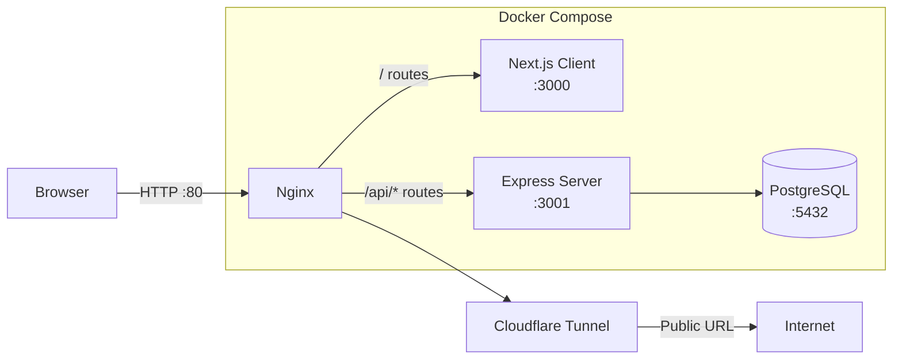
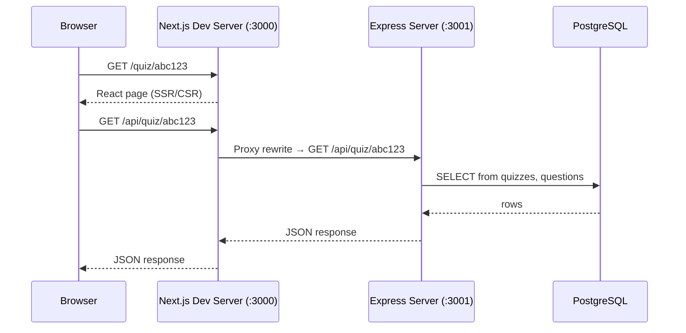
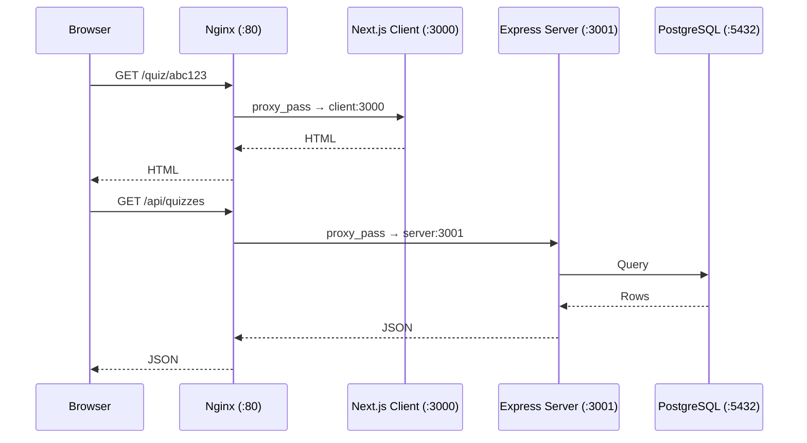
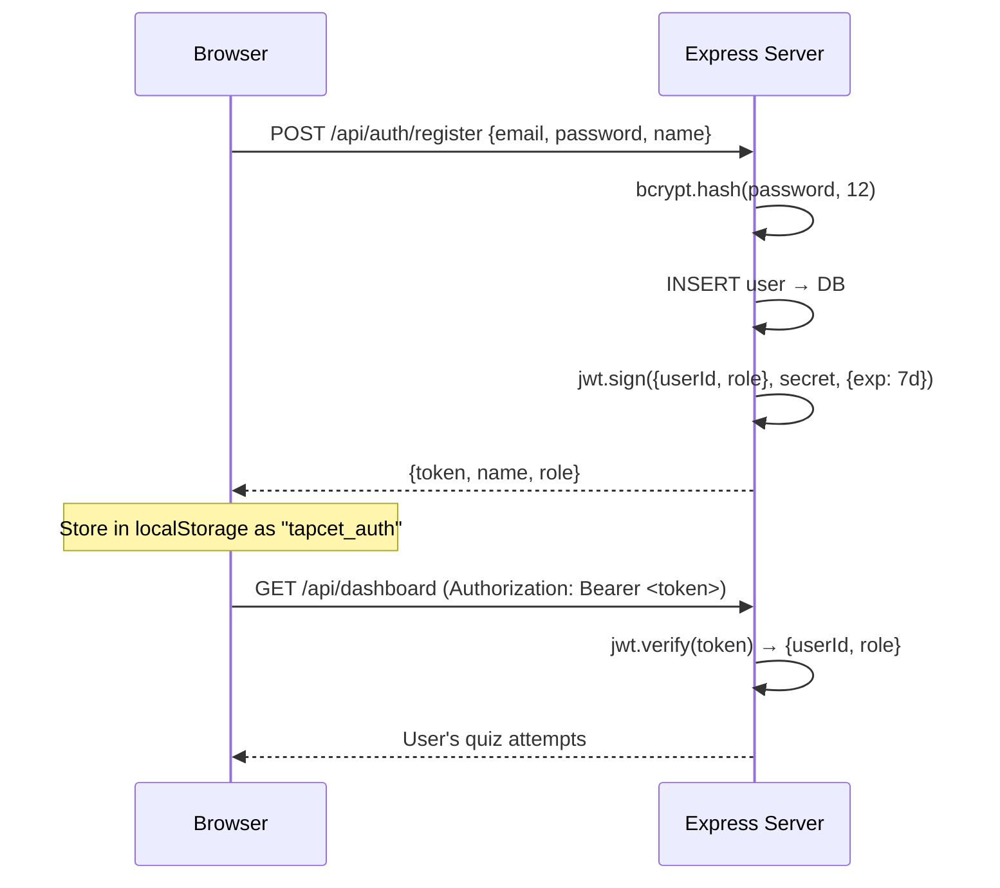

# Architecture

## System Overview

Tapcet is a monorepo containing two independently built applications — a **Next.js 16** frontend client and an **Express** backend server — fronted by **Nginx** as a reverse proxy and backed by **PostgreSQL 16**.



In **local development**, the Next.js dev server proxies `/api/*` requests to the Express server via [Next.js rewrites](../client/next.config.ts), so Nginx is not needed.

## Tech Stack

| Layer | Technology | Version |
|---|---|---|
| Frontend | Next.js (App Router) | 16.2 |
| UI Components | shadcn/ui (Base UI + CVA) | v4 |
| Styling | Tailwind CSS | v4 |
| Backend | Express.js | 4.x |
| ORM | Drizzle ORM | 0.40 |
| Database | PostgreSQL | 16 |
| Auth | JWT (jsonwebtoken) + bcrypt | — |
| Containerization | Docker + Docker Compose | — |
| Reverse Proxy | Nginx | Alpine |
| Tunnel | Cloudflare Tunnel (cloudflared) | Latest |

## Monorepo Structure

```
tapcet-next/
├── client/                          # Next.js 16 frontend
│   ├── src/
│   │   ├── app/                     # App Router pages & layouts
│   │   │   ├── admin/_components/   # Admin dashboard tabs
│   │   │   ├── collection/          # Collection CRUD pages
│   │   │   ├── collections/         # Collections browse
│   │   │   ├── dashboard/_components/  # Dashboard sections
│   │   │   ├── login/               # Login page
│   │   │   ├── mock-exams/          # Mock exam listings
│   │   │   ├── quiz/                # Quiz player, create, edit, results, leaderboard
│   │   │   ├── register/            # Registration page
│   │   │   ├── review/              # Spaced repetition review
│   │   │   └── user/                # User profile
│   │   ├── components/              # Shared UI (navbar, modals, importers)
│   │   │   └── ui/                  # shadcn/ui Base UI primitives
│   │   ├── lib/                     # API client, auth context, types, utils, hooks
│   │   │   ├── api/                 # Domain-specific API functions
│   │   │   ├── constants/           # App constants
│   │   │   ├── hooks/               # Custom React hooks
│   │   │   └── types/               # Domain-specific TypeScript types
│   │   └── test-utils/              # Vitest + jsdom test setup
│   ├── next.config.ts               # Rewrites, standalone output
│   └── package.json
│
├── server/                          # Express REST API
│   ├── src/
│   │   ├── core/                    # Shared infrastructure
│   │   │   ├── config/              # App configuration (spaced repetition)
│   │   │   ├── constants/           # App-wide constants (limits, tags, report status)
│   │   │   ├── db/                  # Drizzle schema, connection, migrate, seed
│   │   │   ├── errors/              # AppError class, error response formatter
│   │   │   └── middleware/          # JWT auth, role guards, request validation
│   │   ├── modules/                 # Domain modules (routes, schemas, services co-located)
│   │   │   ├── auth/                # Registration & login
│   │   │   ├── collection/          # CRUD collections, follow/unfollow
│   │   │   ├── quiz/                # Quiz listing, detail, submission, leaderboard
│   │   │   ├── quiz-management/     # User & admin quiz CRUD
│   │   │   ├── rating/              # Quiz rating
│   │   │   ├── report/              # Question reporting
│   │   │   ├── review/              # Spaced repetition review queue
│   │   │   └── user/                # Dashboard, weakness analysis, profiles
│   │   ├── test-utils/              # Server test helpers
│   │   ├── env.ts                   # Environment variable loading
│   │   └── index.ts                 # Express app entry point
│   ├── drizzle/                     # SQL migration files
│   ├── drizzle.config.ts            # Drizzle Kit config
│   └── package.json
│
├── nginx/
│   └── nginx.conf                   # Reverse proxy configuration
│
├── docker-compose.yml               # Full-stack orchestration
├── Dockerfile                       # Server multi-stage build
├── Dockerfile.client                # Client standalone build
├── .env.example                     # Environment variable template
└── package.json                     # Root workspace scripts
```

## Request Flow

### Local Development



### Production (Docker Compose)



## Authentication Flow



## Key Design Decisions

1. **Server-side grading** — Answers are validated on the server. The quiz detail endpoint (`GET /api/quiz/:id`) intentionally omits the `answer` column to prevent cheating.

2. **Optional auth for quiz submission** — Users can take quizzes without logging in (anonymous with a nickname). Authenticated users get their attempts linked to their account for the dashboard.

3. **Standalone Next.js output** — In production, Next.js builds a self-contained `standalone` directory that runs with plain `node server.js`, eliminating the need for `node_modules` in the Docker image.

4. **Nginx as API gateway** — In production, Nginx handles routing: `/api/*` goes to Express, everything else goes to Next.js. This removes the need for Next.js rewrites in production.

5. **User-Generated Quizzes** — Normal users and admins can create their own quizzes with visibility scopes (`public` or `draft`). This democratizes content creation while keeping drafts private to the creator.
