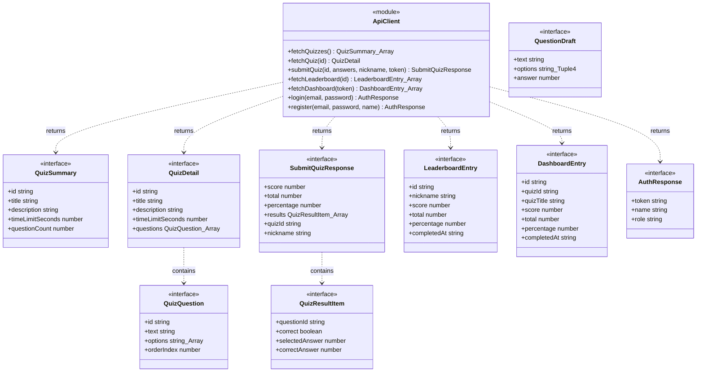

# API Client and Shared Types

```mermaid
classDiagram
    direction TB

    class ApiClient {
        <<module>>
        +fetchQuizzes() QuizSummary_Array
        +fetchQuiz(id) QuizDetail
        +submitQuiz(id, answers, nickname, token) SubmitQuizResponse
        +fetchLeaderboard(id) LeaderboardEntry_Array
        +fetchDashboard(token) DashboardEntry_Array
        +login(email, password) AuthResponse
        +register(email, password, name) AuthResponse
    }

    class QuizSummary {
        <<interface>>
        +id string
        +title string
        +description string
        +timeLimitSeconds number
        +questionCount number
    }

    class QuizQuestion {
        <<interface>>
        +id string
        +text string
        +options string_Array
        +orderIndex number
    }

    class QuizDetail {
        <<interface>>
        +id string
        +title string
        +description string
        +timeLimitSeconds number
        +questions QuizQuestion_Array
    }

    class QuizResultItem {
        <<interface>>
        +questionId string
        +correct boolean
        +selectedAnswer number
        +correctAnswer number
    }

    class SubmitQuizResponse {
        <<interface>>
        +score number
        +total number
        +percentage number
        +results QuizResultItem_Array
        +quizId string
        +nickname string
    }

    class LeaderboardEntry {
        <<interface>>
        +id string
        +nickname string
        +score number
        +total number
        +percentage number
        +completedAt string
    }

    class DashboardEntry {
        <<interface>>
        +id string
        +quizId string
        +quizTitle string
        +score number
        +total number
        +percentage number
        +completedAt string
    }

    class AuthResponse {
        <<interface>>
        +token string
        +name string
        +role string
    }

    class QuestionDraft {
        <<interface>>
        +text string
        +options string_Tuple4
        +answer number
    }

    ApiClient ..> QuizSummary : returns
    ApiClient ..> QuizDetail : returns
    ApiClient ..> SubmitQuizResponse : returns
    ApiClient ..> LeaderboardEntry : returns
    ApiClient ..> DashboardEntry : returns
    ApiClient ..> AuthResponse : returns
    QuizDetail ..> QuizQuestion : contains
    SubmitQuizResponse ..> QuizResultItem : contains
```
