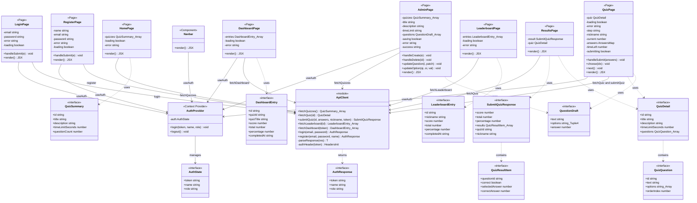

# Client Class Diagram

```mermaid
classDiagram
    direction TB

    class HomePage {
        <<Page>>
        -quizzes QuizSummary_Array
        -loading boolean
        -error string
        +render() JSX
    }

    class LoginPage {
        <<Page>>
        -email string
        -password string
        -error string
        -loading boolean
        +handleSubmit(e) void
        +render() JSX
    }

    class RegisterPage {
        <<Page>>
        -name string
        -email string
        -password string
        -error string
        -loading boolean
        +handleSubmit(e) void
        +render() JSX
    }

    class DashboardPage {
        <<Page>>
        -entries DashboardEntry_Array
        -loading boolean
        -error string
        +render() JSX
    }

    class AdminPage {
        <<Page>>
        -quizzes QuizSummary_Array
        -title string
        -description string
        -timeLimit string
        -questions QuestionDraft_Array
        -saving boolean
        -error string
        -success string
        +handleCreate(e) void
        +handleDelete(id) void
        +updateQuestion(i, patch) void
        +updateOption(qi, oi, val) void
        +render() JSX
    }

    class QuizPage {
        <<Page>>
        -quiz QuizDetail
        -loading boolean
        -error string
        -step string
        -nickname string
        -current number
        -answers AnswersMap
        -timeLeft number
        -submitting boolean
        +handleSubmit(answers) void
        +choose(idx) void
        +next() void
        +render() JSX
    }

    class ResultsPage {
        <<Page>>
        -result SubmitQuizResponse
        -quiz QuizDetail
        +render() JSX
    }

    class LeaderboardPage {
        <<Page>>
        -entries LeaderboardEntry_Array
        -loading boolean
        -error string
        +render() JSX
    }

    class Navbar {
        <<Component>>
        +render() JSX
    }

    class AuthProvider {
        <<Context Provider>>
        -auth AuthState
        +login(token, name, role) void
        +logout() void
    }

    class AuthState {
        <<interface>>
        +token string
        +name string
        +role string
    }

    class ApiClient {
        <<module>>
        +fetchQuizzes() QuizSummary_Array
        +fetchQuiz(id) QuizDetail
        +submitQuiz(id, answers, nickname, token) SubmitQuizResponse
        +fetchLeaderboard(id) LeaderboardEntry_Array
        +fetchDashboard(token) DashboardEntry_Array
        +login(email, password) AuthResponse
        +register(email, password, name) AuthResponse
        -parseResponse(res) T
        -authHeader(token) HeadersInit
    }

    class QuizSummary {
        <<interface>>
        +id string
        +title string
        +description string
        +timeLimitSeconds number
        +questionCount number
    }

    class QuizQuestion {
        <<interface>>
        +id string
        +text string
        +options string_Array
        +orderIndex number
    }

    class QuizDetail {
        <<interface>>
        +id string
        +title string
        +description string
        +timeLimitSeconds number
        +questions QuizQuestion_Array
    }

    class SubmitQuizResponse {
        <<interface>>
        +score number
        +total number
        +percentage number
        +results QuizResultItem_Array
        +quizId string
        +nickname string
    }

    class QuizResultItem {
        <<interface>>
        +questionId string
        +correct boolean
        +selectedAnswer number
        +correctAnswer number
    }

    class LeaderboardEntry {
        <<interface>>
        +id string
        +nickname string
        +score number
        +total number
        +percentage number
        +completedAt string
    }

    class DashboardEntry {
        <<interface>>
        +id string
        +quizId string
        +quizTitle string
        +score number
        +total number
        +percentage number
        +completedAt string
    }

    class AuthResponse {
        <<interface>>
        +token string
        +name string
        +role string
    }

    class QuestionDraft {
        <<interface>>
        +text string
        +options string_Tuple4
        +answer number
    }

    AuthProvider --> AuthState : manages
    Navbar --> AuthProvider : useAuth
    LoginPage --> AuthProvider : useAuth
    RegisterPage --> AuthProvider : useAuth
    DashboardPage --> AuthProvider : useAuth
    AdminPage --> AuthProvider : useAuth
    QuizPage --> AuthProvider : useAuth

    HomePage --> ApiClient : fetchQuizzes
    LoginPage --> ApiClient : login
    RegisterPage --> ApiClient : register
    DashboardPage --> ApiClient : fetchDashboard
    AdminPage --> ApiClient : fetchQuizzes
    QuizPage --> ApiClient : fetchQuiz and submitQuiz
    ResultsPage --> ApiClient : fetchQuiz
    LeaderboardPage --> ApiClient : fetchLeaderboard

    HomePage ..> QuizSummary : uses
    QuizPage ..> QuizDetail : uses
    QuizPage ..> QuestionDraft : uses
    ResultsPage ..> SubmitQuizResponse : uses
    ResultsPage ..> QuizDetail : uses
    LeaderboardPage ..> LeaderboardEntry : uses
    DashboardPage ..> DashboardEntry : uses
    AdminPage ..> QuestionDraft : uses
    QuizDetail ..> QuizQuestion : contains
    SubmitQuizResponse ..> QuizResultItem : contains
    ApiClient ..> AuthResponse : returns
```
