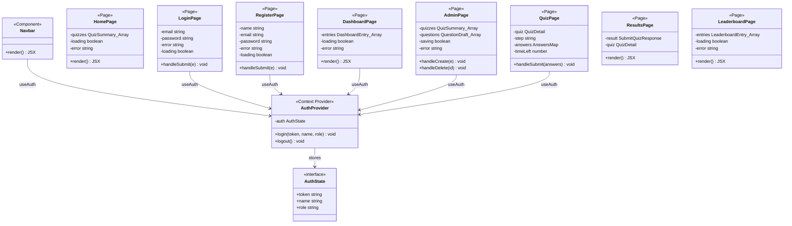

# Pages and Auth

```mermaid
classDiagram
    direction TB

    class Navbar {
        <<Component>>
        +render() JSX
    }

    class AuthProvider {
        <<Context Provider>>
        -auth AuthState
        +login(token, name, role) void
        +logout() void
    }

    class AuthState {
        <<interface>>
        +token string
        +name string
        +role string
    }

    class HomePage {
        <<Page>>
        -quizzes QuizSummary_Array
        -loading boolean
        -error string
        +render() JSX
    }

    class LoginPage {
        <<Page>>
        -email string
        -password string
        -error string
        -loading boolean
        +handleSubmit(e) void
    }

    class RegisterPage {
        <<Page>>
        -name string
        -email string
        -password string
        -error string
        -loading boolean
        +handleSubmit(e) void
    }

    class DashboardPage {
        <<Page>>
        -entries DashboardEntry_Array
        -loading boolean
        -error string
        +render() JSX
    }

    class AdminPage {
        <<Page>>
        -quizzes QuizSummary_Array
        -questions QuestionDraft_Array
        -saving boolean
        -error string
        +handleCreate(e) void
        +handleDelete(id) void
    }

    class QuizPage {
        <<Page>>
        -quiz QuizDetail
        -step string
        -answers AnswersMap
        -timeLeft number
        +handleSubmit(answers) void
    }

    class ResultsPage {
        <<Page>>
        -result SubmitQuizResponse
        -quiz QuizDetail
        +render() JSX
    }

    class LeaderboardPage {
        <<Page>>
        -entries LeaderboardEntry_Array
        -loading boolean
        -error string
        +render() JSX
    }

    AuthProvider --> AuthState : stores
    Navbar --> AuthProvider : useAuth
    LoginPage --> AuthProvider : useAuth
    RegisterPage --> AuthProvider : useAuth
    DashboardPage --> AuthProvider : useAuth
    AdminPage --> AuthProvider : useAuth
    QuizPage --> AuthProvider : useAuth
```
