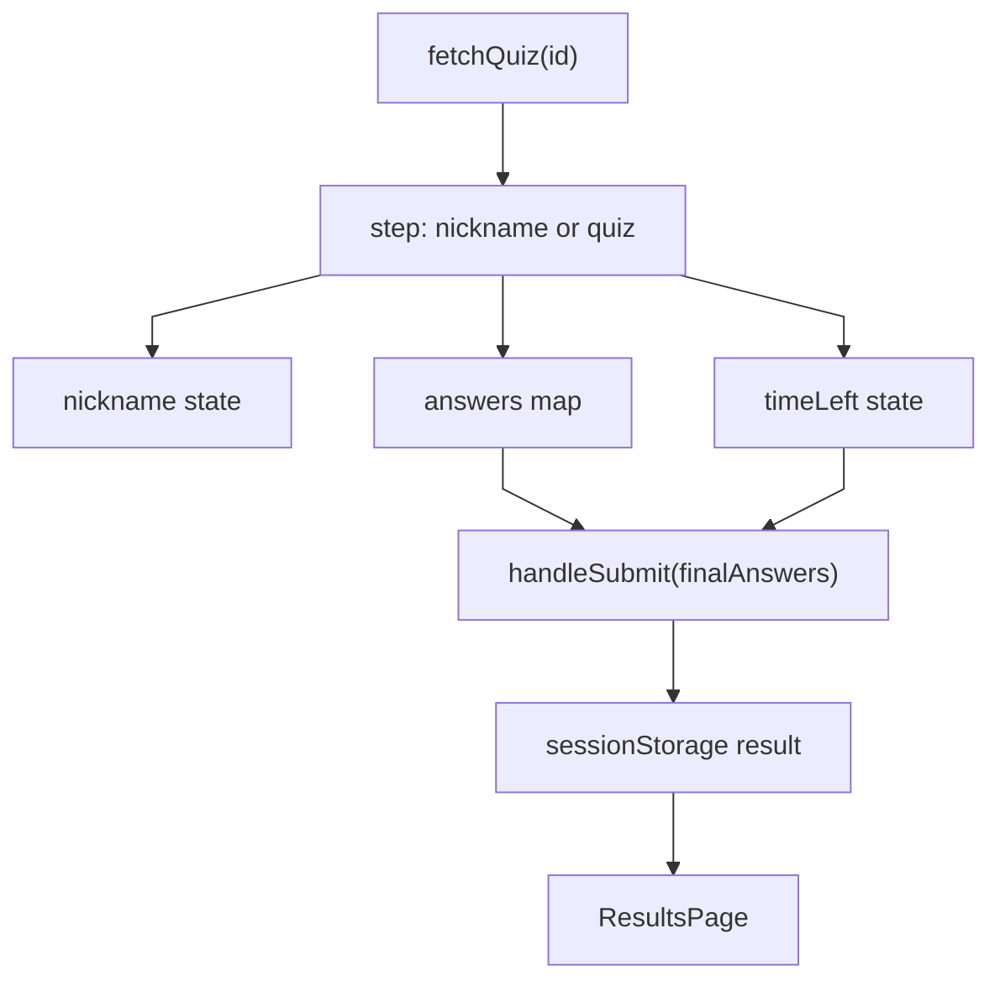

# Quiz Runtime

```mermaid
%%{ init: { 'flowchart': { 'curve': 'linear' } } }%%
flowchart TB
    Fetch["fetchQuiz(id)"]
    Step["step: nickname or quiz"]
    Nickname["nickname state"]
    Timer["timeLeft state"]
    Answers["answers map"]
    Submit["handleSubmit(finalAnswers)"]
    Result["sessionStorage result"]
    ResultsPage["ResultsPage"]

    Fetch --> Step
    Step --> Nickname
    Step --> Timer
    Step --> Answers
    Answers --> Submit
    Timer --> Submit
    Submit --> Result
    Result --> ResultsPage
```
