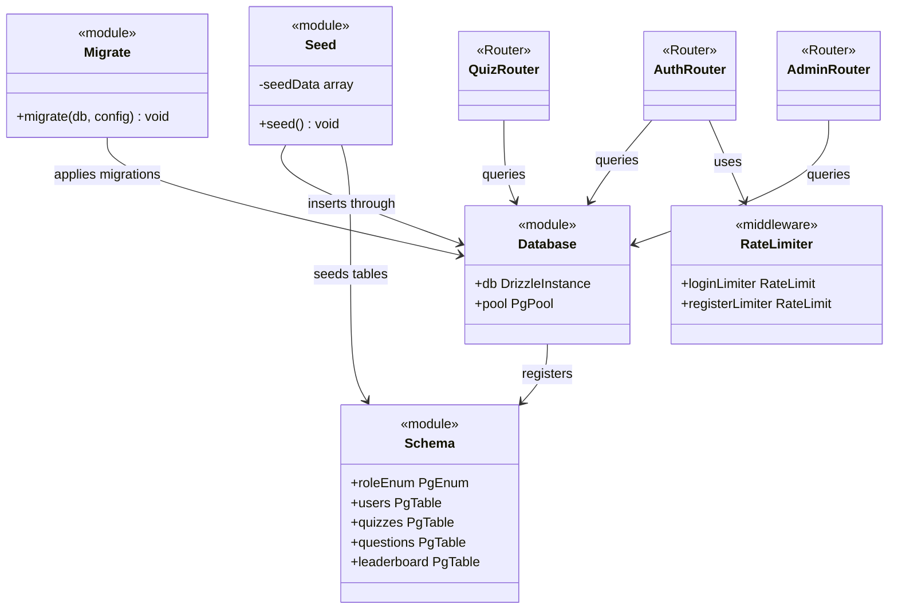

# Data Layer and Startup

```mermaid
classDiagram
    direction TB

    class Database {
        <<module>>
        +db DrizzleInstance
        +pool PgPool
    }

    class Schema {
        <<module>>
        +roleEnum PgEnum
        +users PgTable
        +quizzes PgTable
        +questions PgTable
        +leaderboard PgTable
    }

    class Seed {
        <<module>>
        -seedData array
        +seed() void
    }

    class Migrate {
        <<module>>
        +migrate(db, config) void
    }

    class RateLimiter {
        <<middleware>>
        +loginLimiter RateLimit
        +registerLimiter RateLimit
    }

    class AuthRouter {
        <<Router>>
    }

    class QuizRouter {
        <<Router>>
    }

    class AdminRouter {
        <<Router>>
    }

    Database --> Schema : registers
    Seed --> Database : inserts through
    Seed --> Schema : seeds tables
    Migrate --> Database : applies migrations
    AuthRouter --> Database : queries
    QuizRouter --> Database : queries
    AdminRouter --> Database : queries
    AuthRouter --> RateLimiter : uses
```
