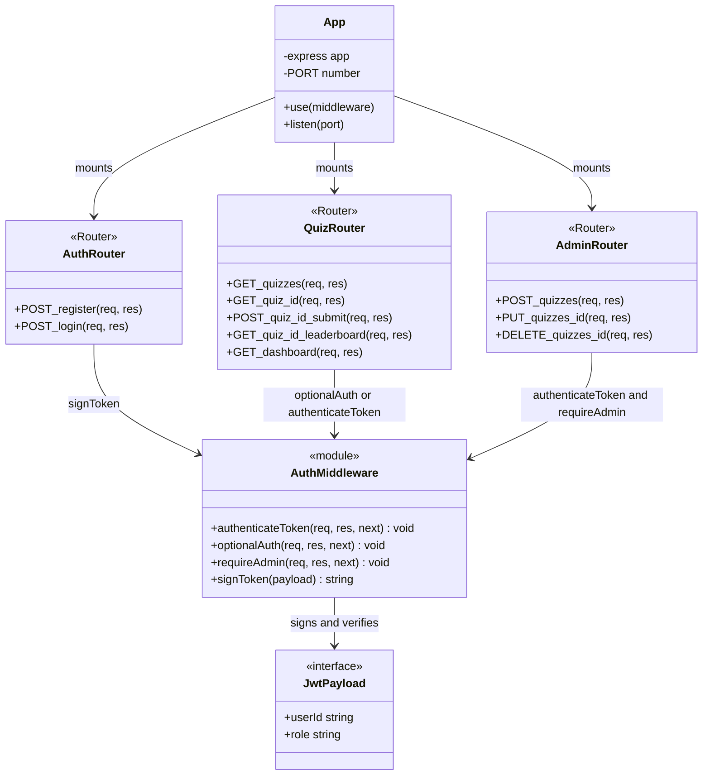

# Routers and Auth

```mermaid
classDiagram
    direction TB

    class App {
        -express app
        -PORT number
        +use(middleware)
        +listen(port)
    }

    class AuthRouter {
        <<Router>>
        +POST_register(req, res)
        +POST_login(req, res)
    }

    class QuizRouter {
        <<Router>>
        +GET_quizzes(req, res)
        +GET_quiz_id(req, res)
        +POST_quiz_id_submit(req, res)
        +GET_quiz_id_leaderboard(req, res)
        +GET_dashboard(req, res)
    }

    class AdminRouter {
        <<Router>>
        +POST_quizzes(req, res)
        +PUT_quizzes_id(req, res)
        +DELETE_quizzes_id(req, res)
    }

    class AuthMiddleware {
        <<module>>
        +authenticateToken(req, res, next) void
        +optionalAuth(req, res, next) void
        +requireAdmin(req, res, next) void
        +signToken(payload) string
    }

    class JwtPayload {
        <<interface>>
        +userId string
        +role string
    }

    App --> AuthRouter : mounts
    App --> QuizRouter : mounts
    App --> AdminRouter : mounts
    AuthRouter --> AuthMiddleware : signToken
    QuizRouter --> AuthMiddleware : optionalAuth or authenticateToken
    AdminRouter --> AuthMiddleware : authenticateToken and requireAdmin
    AuthMiddleware --> JwtPayload : signs and verifies
```
