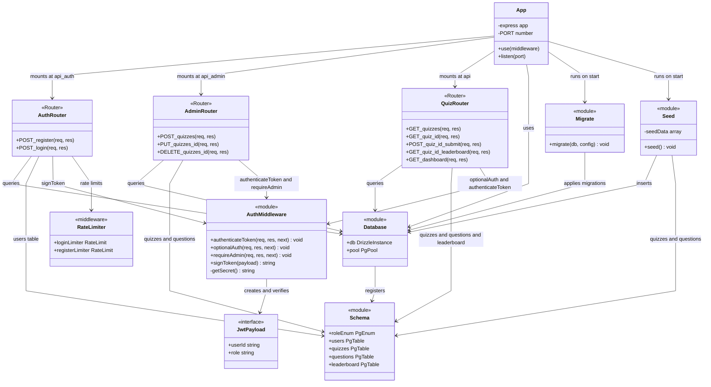

# Server Class Diagram

```mermaid
%%{ init: { 'flowchart': { 'curve': 'linear' } } }%%
classDiagram
    direction TB

    class App {
        -express app
        -PORT number
        +use(middleware)
        +listen(port)
    }

    class AuthRouter {
        <<Router>>
        +POST_register(req, res)
        +POST_login(req, res)
    }

    class AdminRouter {
        <<Router>>
        +POST_quizzes(req, res)
        +PUT_quizzes_id(req, res)
        +DELETE_quizzes_id(req, res)
    }

    class QuizRouter {
        <<Router>>
        +GET_quizzes(req, res)
        +GET_quiz_id(req, res)
        +POST_quiz_id_submit(req, res)
        +GET_quiz_id_leaderboard(req, res)
        +GET_dashboard(req, res)
    }

    class AuthMiddleware {
        <<module>>
        +authenticateToken(req, res, next) void
        +optionalAuth(req, res, next) void
        +requireAdmin(req, res, next) void
        +signToken(payload) string
        -getSecret() string
    }

    class JwtPayload {
        <<interface>>
        +userId string
        +role string
    }

    class Database {
        <<module>>
        +db DrizzleInstance
        +pool PgPool
    }

    class Schema {
        <<module>>
        +roleEnum PgEnum
        +users PgTable
        +quizzes PgTable
        +questions PgTable
        +leaderboard PgTable
    }

    class Seed {
        <<module>>
        -seedData array
        +seed() void
    }

    class Migrate {
        <<module>>
        +migrate(db, config) void
    }

    class RateLimiter {
        <<middleware>>
        +loginLimiter RateLimit
        +registerLimiter RateLimit
    }

    App --> AuthRouter : mounts at api_auth
    App --> AdminRouter : mounts at api_admin
    App --> QuizRouter : mounts at api
    App --> Database : uses
    App --> Migrate : runs on start
    App --> Seed : runs on start

    AuthRouter --> Database : queries
    AuthRouter --> Schema : users table
    AuthRouter --> AuthMiddleware : signToken
    AuthRouter --> RateLimiter : rate limits

    AdminRouter --> Database : queries
    AdminRouter --> Schema : quizzes and questions
    AdminRouter --> AuthMiddleware : authenticateToken and requireAdmin

    QuizRouter --> Database : queries
    QuizRouter --> Schema : quizzes and questions and leaderboard
    QuizRouter --> AuthMiddleware : optionalAuth and authenticateToken

    AuthMiddleware --> JwtPayload : creates and verifies

    Database --> Schema : registers

    Seed --> Database : inserts
    Seed --> Schema : quizzes and questions

    Migrate --> Database : applies migrations
```
