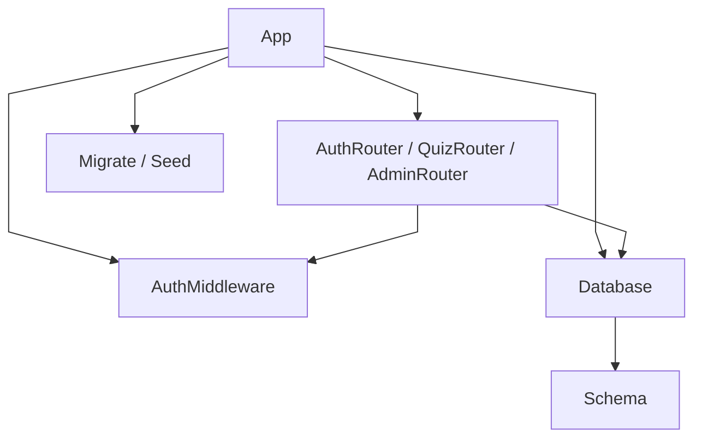

# Server Overview

```mermaid
%%{ init: { 'flowchart': { 'curve': 'linear' } } }%%
flowchart TB
    App["App"]
    Routers["AuthRouter / QuizRouter / AdminRouter"]
    Auth["AuthMiddleware"]
    Database["Database"]
    Schema["Schema"]
    Startup["Migrate / Seed"]

    App --> Routers
    App --> Auth
    App --> Database
    App --> Startup
    Database --> Schema
    Routers --> Database
    Routers --> Auth
```
