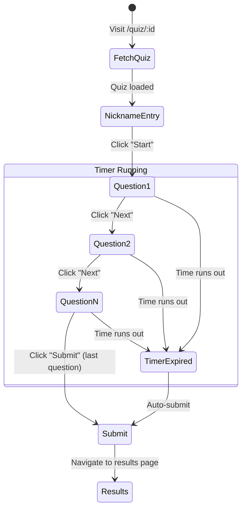

# Client

The frontend is a **Next.js 16** application using the App Router, styled with **Tailwind CSS v4** and **shadcn/ui** components.

## Pages & Routing

```mermaid
graph TD
    Root["/ (Home)"] -->|Quiz card click| Quiz["/quiz/[id]"]
    Root -->|Nav link| Login["/login"]
    Root -->|Nav link| Register["/register"]
    Login -->|After login| Root
    Register -->|After register| Root
    Root -->|Nav (auth'd)| Dashboard["/dashboard"]
    Root -->|Nav (admin)| Admin["/admin"]
    Quiz -->|After submit| Results["/quiz/[id]/results"]
    Dashboard -->|Row click| Leaderboard["/quiz/[id]/leaderboard"]
```

### Page Reference

| Route | File | Auth | Description |
|---|---|---|---|
| `/` | `app/page.tsx` | None | Home page — lists all quizzes as cards |
| `/quiz/[id]` | `app/quiz/[id]/page.tsx` | None | Quiz player — nickname entry, timed questions, submission |
| `/quiz/[id]/results` | `app/quiz/[id]/results/page.tsx` | None | Score breakdown with per-question feedback |
| `/quiz/[id]/leaderboard` | `app/quiz/[id]/leaderboard/page.tsx` | None | Top 10 leaderboard for a quiz |
| `/quiz/[id]/edit` | `app/quiz/[id]/edit/page.tsx` | Required (owner/admin) | Edit quiz questions and metadata |
| `/quiz/create` | `app/quiz/create/page.tsx` | Required | Create new quiz |
| `/login` | `app/login/page.tsx` | None | Login form |
| `/register` | `app/register/page.tsx` | None | Registration form |
| `/dashboard` | `app/dashboard/page.tsx` | Required | Multi-section user dashboard (overview, attempts, weaknesses, review queue, my quizzes, my collections) |
| `/admin` | `app/admin/page.tsx` | Admin only | Admin dashboard — quiz management, mock exams, and question reports queue |
| `/collections` | `app/collections/page.tsx` | None | Collections browse page |
| `/collection/[id]` | `app/collection/[id]/page.tsx` | None | Collection details and quiz list |
| `/collection/create` | `app/collection/create/page.tsx` | Required | Create collection form |
| `/collection/[id]/edit` | `app/collection/[id]/edit/page.tsx` | Required | Update collection metadata and quizzes |
| `/review` | `app/review/page.tsx` | Required | Spaced repetition review session |
| `/mock-exams` | `app/mock-exams/page.tsx` | None | Browse official mock exam quizzes |

## Authentication

### Auth Context (`lib/auth-context.tsx`)

Authentication state is managed via React Context using the `AuthProvider`:

```typescript
interface AuthState {
  token: string | null;   // JWT token
  name: string | null;    // User's display name
  role: "user" | "admin" | null;
}
```

**Key behaviors:**
- State is persisted in `localStorage` under the key `tapcet_auth`
- On mount, the provider reads from `localStorage` and restores the session
- `login()` saves the token/name/role and updates context
- `logout()` clears both context and `localStorage`
- Server-side rendering guard: returns empty state when `window` is undefined

**Usage:**

```tsx
import { useAuth } from "@/lib/auth-context";

function MyComponent() {
  const { token, name, role, login, logout } = useAuth();
  // ...
}
```

### Route Protection

Protected pages handle auth client-side:

```tsx
useEffect(() => {
  if (!token) {
    router.replace("/login");  // Redirect unauthenticated users
  }
}, [token, router]);
```

Admin pages additionally check `role !== "admin"` and redirect to `/`.

## API Client (`lib/api.ts`)

A thin wrapper around `fetch()` that provides typed functions for all API calls:

| Function | Endpoint | Auth |
|---|---|---|
| `fetchQuizzes(params?)` | `GET /api/quizzes` | None |
| `fetchMockExams(exam?)` | `GET /api/quizzes?quizType=mock_exam&official=true` | None |
| `fetchQuiz(id)` | `GET /api/quiz/:id` | None |
| `fetchQuizForEdit(id, token)` | `GET /api/quiz/:id/edit` | Required |
| `submitQuiz(id, answers, nickname?, token?)` | `POST /api/quiz/:id/submit` | Optional |
| `fetchLeaderboard(id)` | `GET /api/quiz/:id/leaderboard` | None |
| `createQuiz(payload, token)` | `POST /api/quiz` | Required |
| `updateQuiz(id, payload, token)` | `PUT /api/quiz/:id` | Required |
| `deleteQuiz(id, token)` | `DELETE /api/quiz/:id` | Required |
| `fetchMyQuizzes(token)` | `GET /api/my-quizzes` | Required |
| `createAdminQuiz(payload, token)` | `POST /api/admin/quizzes` | Admin |
| `deleteAdminQuiz(id, token)` | `DELETE /api/admin/quizzes/:id` | Admin |
| `fetchDashboard(token)` | `GET /api/dashboard` | Required |
| `fetchWeakness(token)` | `GET /api/dashboard/weakness` | Required |
| `fetchQuizRating(id, token?)` | `GET /api/quiz/:id/rating` | Optional |
| `rateQuiz(id, rating, token)` | `POST /api/quiz/:id/rate` | Required |
| `reportQuestion(questionId, payload, token)` | `POST /api/question/:id/report` | Required |
| `fetchAdminReports(params, token)` | `GET /api/admin/reports` | Admin |
| `resolveReport(id, status, token)` | `PUT /api/admin/report/:id` | Admin |
| `fetchReviewQueue(token)` | `GET /api/review-queue` | Required |
| `fetchReviewStats(token)` | `GET /api/review-queue/stats` | Required |
| `answerReviewItem(questionId, selectedAnswer, token)` | `POST /api/review-queue/answer` | Required |
| `login(email, password)` | `POST /api/auth/login` | None |
| `register(email, password, name)` | `POST /api/auth/register` | None |
| `fetchCollections(params?)` | `GET /api/collections` | None |
| `fetchCollection(id, token?)` | `GET /api/collection/:id` | Optional |
| `createCollection(payload, token)` | `POST /api/collection` | Required |
| `updateCollection(id, payload, token)` | `PUT /api/collection/:id` | Required |
| `deleteCollection(id, token)` | `DELETE /api/collection/:id` | Required |
| `fetchMyCollections(token)` | `GET /api/my-collections` | Required |
| `toggleFollowCollection(id, token)` | `POST /api/collection/:id/follow` | Required |
| `addQuizToCollection(collectionId, quizId, token)` | `POST /api/collection/:id/quizzes/:quizId` | Required |
| `removeQuizFromCollection(collectionId, quizId, token)` | `DELETE /api/collection/:id/quizzes/:quizId` | Required |

All functions use a shared `parseResponse<T>()` helper that:
1. Checks `res.ok` and throws an `Error` with the server's error message if not
2. Returns the parsed JSON body typed as `T`

The `authHeader()` helper adds `Authorization: Bearer <token>` when a token is provided.

## TypeScript Types (`lib/types.ts`)

Shared type definitions for API responses:

| Type | Used For |
|---|---|
| `QuizSummary` | Quiz list items (with `questionCount`, `scoringMode`, `quizType`) |
| `QuizQuestion` | Individual question (no `answer` field) |
| `QuizSection` | Section containing grouped questions |
| `QuizDetail` | Full quiz with `questions[]`, `sections[]`, and scoring config |
| `EditableQuizQuestion` | Question with `answer` field — edit pages only |
| `EditableQuizSection` | Section with editable questions |
| `EditableQuizDetail` | Full quiz detail with answers for edit pages |
| `QuizFormPayload` | Create/update quiz request body |
| `MyQuizSummary` | User's own quiz summary (includes `visibility`, for dashboard/my-quizzes) |
| `AnswersMap` | `Record<string, number>` — maps question ID to selected option index |
| `QuizResultItem` | Per-question result after submission |
| `SubmitQuizResponse` | Full submission response (score, results, scoringMode, penaltyPoints) |
| `LeaderboardEntry` | Leaderboard row |
| `DashboardEntry` | Dashboard row (includes `quizTitle`) |
| `WeaknessEntry` | Per-subject accuracy (`subject`, `totalCorrect`, `totalQuestions`, `attempts`, `percentage`) |
| `QuizRating` | Rating summary (`averageRating`, `totalRatings`, `userRating`) |
| `AdminReport` | Question report with status, reporter name, and resolution info |
| `ReviewQueueItem` | Due review item with question text and quiz metadata |
| `ReviewAnswerResponse` | Result of answering a review item (`correct`, `newIntervalDays`, `nextReviewAt`) |
| `ReviewStats` | `{ dueToday, total }` for dashboard badge |
| `AuthResponse` | Login/register response (`token`, `name`, `role`) |
| `CollectionSummary` | Collection metadata for browse lists |
| `CollectionDetail` | Full collection info with quiz list and `isFollowing` status |
| `MyCollectionSummary` | Creator's own collection (includes drafts, no follower count) |
| `CollectionFormPayload` | Create/update collection request body |

## Components

### Navbar (`components/navbar.tsx`)

The navigation bar appears on all pages via the root layout. It adapts based on auth state:

| State | Shows |
|---|---|
| **Guest** | "Log in" button + "Sign up" button |
| **Authenticated user** | User name (links to dashboard) + "Log out" button |
| **Authenticated admin** | User name + admin badge + "Manage" link + "Log out" button |

### Feature Components (`components/`)

| Component | File | Usage |
|---|---|---|
| `ReportModal` | `components/ReportModal.tsx` | Question flagging dialog (incorrect / ambiguous / duplicate) |
| `StarRating` | `components/StarRating.tsx` | Interactive 1–5 star rating widget |
| `ErrorAlert` | `components/ErrorAlert.tsx` | Inline error message display |

### Dashboard Sub-Components (`app/dashboard/_components/`)

Each section of the dashboard is its own component:

| Component | Description |
|---|---|
| `DashboardOverview` | Stats summary cards |
| `DashboardAttempts` | Quiz attempt history table |
| `DashboardWeakness` | Per-subject accuracy bars (weakest first) |
| `DashboardReviewQueue` | Due count stats and "Start Review" CTA |
| `DashboardMyQuizzes` | User's own quizzes with edit/delete |
| `DashboardMyCollections` | User's own collections with edit/delete |

### Admin Sub-Components (`app/admin/_components/`)

| Component | Description |
|---|---|
| `AdminQuizzesTab` | Quiz list with create/delete |
| `AdminMockExamsTab` | Mock exam management |
| `AdminReportsTab` | Flagged question reports with status lifecycle |

### UI Components (`components/ui/`)

The project uses [shadcn/ui](https://ui.shadcn.com/) components built on [Base UI](https://base-ui.com/) with [CVA](https://cva.style/) and Tailwind CSS:

| Component | File | Usage |
|---|---|---|
| `AlertDialog` | `alert-dialog.tsx` | Delete quiz confirmation |
| `Avatar` | `avatar.tsx` | — |
| `Badge` | `badge.tsx` | Question counts, time limits, scores |
| `Button` | `button.tsx` | Actions throughout the app |
| `Card` | `card.tsx` | Quiz cards, form containers |
| `Dialog` | `dialog.tsx` | — |
| `Input` | `input.tsx` | Form inputs |
| `Label` | `label.tsx` | Form labels |
| `Progress` | `progress.tsx` | Quiz progress bar |
| `Separator` | `separator.tsx` | Visual dividers |
| `Sheet` | `sheet.tsx` | — |
| `Skeleton` | `skeleton.tsx` | Loading placeholders |
| `Table` | `table.tsx` | Dashboard and leaderboard tables |
| `Tabs` | `tabs.tsx` | — |

## Quiz Flow



**Timer behavior:**
- Starts when the user clicks "Start" (enters quiz step)
- Displays remaining seconds in a badge (turns destructive red under 10s)
- **Flat quizzes:** timer expiry auto-submits all current answers
- **Sectioned quizzes:** each section has its own timer; expiry auto-advances to the next section (or submits on the final section). Navigation buttons show "Next →" within a section, "Next Section →" on the last question of a non-final section, and "Submit Quiz" on the last question of the final section.

## Next.js Configuration

```typescript
// client/next.config.ts
const nextConfig = {
  // Standalone output for Docker (set NEXT_OUTPUT=standalone)
  output: process.env.NEXT_OUTPUT === "standalone" ? "standalone" : undefined,

  // Proxy /api/* to Express in development
  async rewrites() {
    return [{ source: "/api/:path*", destination: "http://localhost:3001/api/:path*" }];
  },
};
```

> [!NOTE]
> In production (Docker Compose), Nginx handles the `/api/*` routing, so the rewrite is effectively unused. The `standalone` output mode bundles Next.js into a self-contained directory.

## Root Layout

The root layout (`app/layout.tsx`) wraps all pages with:
1. **`AuthProvider`** — makes authentication state available to all components
2. **`Navbar`** — persistent navigation header
3. **`<main>`** — page content area
