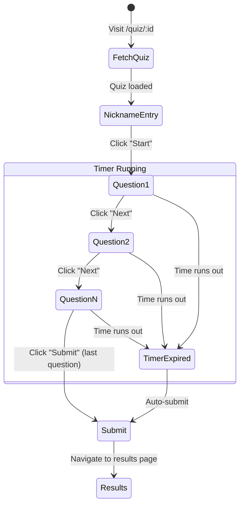

# Client

The frontend is a **Next.js 16** application using the App Router, styled with **Tailwind CSS v4** and **shadcn/ui** components.

## Pages & Routing

```mermaid
graph TD
    Root["/ (Home)"] -->|Quiz card click| Quiz["/quiz/[id]"]
    Root -->|Nav link| Login["/login"]
    Root -->|Nav link| Register["/register"]
    Login -->|After login| Root
    Register -->|After register| Root
    Root -->|Nav (auth'd)| Dashboard["/dashboard"]
    Root -->|Nav (admin)| Admin["/admin"]
    Quiz -->|After submit| Results["/quiz/[id]/results"]
    Dashboard -->|Row click| Leaderboard["/quiz/[id]/leaderboard"]
```

### Page Reference

| Route | File | Auth | Description |
|---|---|---|---|
| `/` | `app/page.tsx` | None | Home page — lists all quizzes as cards |
| `/quiz/[id]` | `app/quiz/[id]/page.tsx` | None | Quiz player — nickname entry, timed questions, submission |
| `/login` | `app/login/page.tsx` | None | Login form |
| `/register` | `app/register/page.tsx` | None | Registration form |
| `/dashboard` | `app/dashboard/page.tsx` | Required | User's quiz attempt history table |
| `/admin` | `app/admin/page.tsx` | Admin only | Quiz management — list, create, delete quizzes |

## Authentication

### Auth Context (`lib/auth-context.tsx`)

Authentication state is managed via React Context using the `AuthProvider`:

```typescript
interface AuthState {
  token: string | null;   // JWT token
  name: string | null;    // User's display name
  role: "user" | "admin" | null;
}
```

**Key behaviors:**
- State is persisted in `localStorage` under the key `tapcet_auth`
- On mount, the provider reads from `localStorage` and restores the session
- `login()` saves the token/name/role and updates context
- `logout()` clears both context and `localStorage`
- Server-side rendering guard: returns empty state when `window` is undefined

**Usage:**

```tsx
import { useAuth } from "@/lib/auth-context";

function MyComponent() {
  const { token, name, role, login, logout } = useAuth();
  // ...
}
```

### Route Protection

Protected pages handle auth client-side:

```tsx
useEffect(() => {
  if (!token) {
    router.replace("/login");  // Redirect unauthenticated users
  }
}, [token, router]);
```

Admin pages additionally check `role !== "admin"` and redirect to `/`.

## API Client (`lib/api.ts`)

A thin wrapper around `fetch()` that provides typed functions for all API calls:

| Function | Endpoint | Auth |
|---|---|---|
| `fetchQuizzes()` | `GET /api/quizzes` | None |
| `fetchQuiz(id)` | `GET /api/quiz/:id` | None |
| `submitQuiz(id, answers, nickname?, token?)` | `POST /api/quiz/:id/submit` | Optional |
| `fetchLeaderboard(id)` | `GET /api/quiz/:id/leaderboard` | None |
| `fetchDashboard(token)` | `GET /api/dashboard` | Required |
| `login(email, password)` | `POST /api/auth/login` | None |
| `register(email, password, name)` | `POST /api/auth/register` | None |

All functions use a shared `parseResponse<T>()` helper that:
1. Checks `res.ok` and throws an `Error` with the server's error message if not
2. Returns the parsed JSON body typed as `T`

The `authHeader()` helper adds `Authorization: Bearer <token>` when a token is provided.

## TypeScript Types (`lib/types.ts`)

Shared type definitions for API responses:

| Type | Used For |
|---|---|
| `QuizSummary` | Quiz list items (with `questionCount`) |
| `QuizQuestion` | Individual question (no `answer` field) |
| `QuizDetail` | Full quiz with `questions[]` |
| `AnswersMap` | `Record<string, number>` — maps question ID to selected option index |
| `QuizResultItem` | Per-question result after submission |
| `SubmitQuizResponse` | Full submission response (score, results, nickname) |
| `LeaderboardEntry` | Leaderboard row |
| `DashboardEntry` | Dashboard row (includes `quizTitle`) |
| `AuthResponse` | Login/register response (`token`, `name`, `role`) |

## Components

### Navbar (`components/navbar.tsx`)

The navigation bar appears on all pages via the root layout. It adapts based on auth state:

| State | Shows |
|---|---|
| **Guest** | "Log in" button + "Sign up" button |
| **Authenticated user** | User name (links to dashboard) + "Log out" button |
| **Authenticated admin** | User name + admin badge + "Manage" link + "Log out" button |

### UI Components (`components/ui/`)

The project uses [shadcn/ui](https://ui.shadcn.com/) components built on [Base UI](https://base-ui.com/) with [CVA](https://cva.style/) and Tailwind CSS:

| Component | File | Usage |
|---|---|---|
| `AlertDialog` | `alert-dialog.tsx` | Delete quiz confirmation |
| `Avatar` | `avatar.tsx` | — |
| `Badge` | `badge.tsx` | Question counts, time limits, scores |
| `Button` | `button.tsx` | Actions throughout the app |
| `Card` | `card.tsx` | Quiz cards, form containers |
| `Dialog` | `dialog.tsx` | — |
| `Input` | `input.tsx` | Form inputs |
| `Label` | `label.tsx` | Form labels |
| `Progress` | `progress.tsx` | Quiz progress bar |
| `Separator` | `separator.tsx` | Visual dividers |
| `Sheet` | `sheet.tsx` | — |
| `Skeleton` | `skeleton.tsx` | Loading placeholders |
| `Table` | `table.tsx` | Dashboard and leaderboard tables |
| `Tabs` | `tabs.tsx` | — |

## Quiz Flow



**Timer behavior:**
- Starts when the user clicks "Start" (enters quiz step)
- Displays remaining seconds in a badge (turns destructive red under 10s)
- Auto-submits all current answers when time reaches 0

## Next.js Configuration

```typescript
// client/next.config.ts
const nextConfig = {
  // Standalone output for Docker (set NEXT_OUTPUT=standalone)
  output: process.env.NEXT_OUTPUT === "standalone" ? "standalone" : undefined,

  // Proxy /api/* to Express in development
  async rewrites() {
    return [{ source: "/api/:path*", destination: "http://localhost:3001/api/:path*" }];
  },
};
```

> [!NOTE]
> In production (Docker Compose), Nginx handles the `/api/*` routing, so the rewrite is effectively unused. The `standalone` output mode bundles Next.js into a self-contained directory.

## Root Layout

The root layout (`app/layout.tsx`) wraps all pages with:
1. **`AuthProvider`** — makes authentication state available to all components
2. **`Navbar`** — persistent navigation header
3. **`<main>`** — page content area
