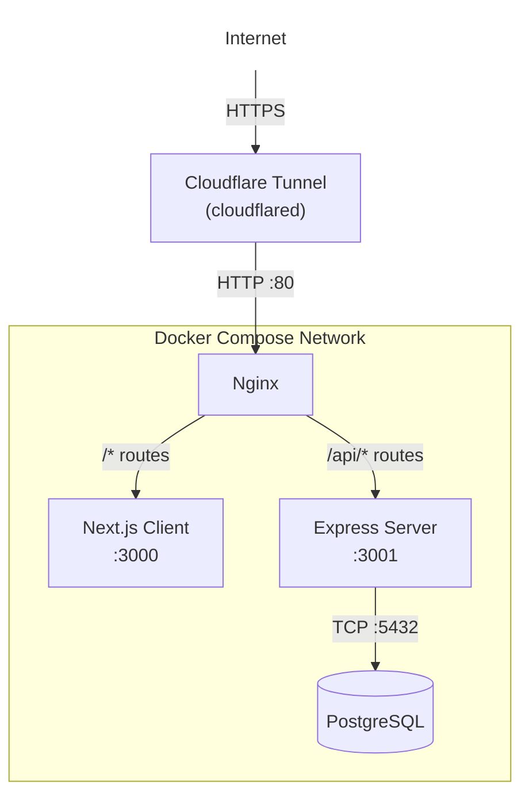
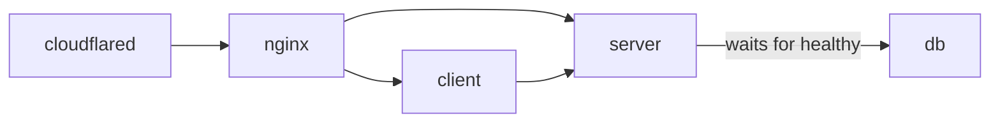

# Deployment

Tapcet uses Docker Compose to orchestrate five services. In production, Cloudflare Tunnel provides a public URL without exposing ports directly.

## Service Architecture



## Docker Compose Services

| Service | Image/Build | Port | Description |
|---|---|---|---|
| `db` | `postgres:16-alpine` | 5432 (internal) | PostgreSQL database with persistent volume |
| `server` | `Dockerfile` (multi-stage) | 3001 (internal) | Express API server |
| `client` | `Dockerfile.client` | 3000 (internal) | Next.js standalone server |
| `nginx` | `nginx:alpine` | **80** (exposed) | Reverse proxy |
| `cloudflared` | `cloudflare/cloudflared:latest` | — | Cloudflare Tunnel agent |

### Service Dependencies



The `server` service waits for `db` to pass its health check (`pg_isready`) before starting. This ensures the database is ready before migrations run.

## Dockerfiles

### Server (`Dockerfile`)

Multi-stage build with 3 stages:

| Stage | Purpose |
|---|---|
| `client-builder` | Installs deps and builds the Next.js app (unused in this Dockerfile — legacy) |
| `server-builder` | Installs deps and compiles TypeScript to `dist/` |
| `runtime` | Production-only deps + compiled JS + Drizzle migration files |

```
Final image contents:
/app/
├── dist/              # Compiled Express server
├── drizzle/           # SQL migration files
├── node_modules/      # Production deps only
└── package.json
```

### Client (`Dockerfile.client`)

Two-stage build for Next.js standalone output:

| Stage | Purpose |
|---|---|
| `builder` | Installs deps and runs `next build` (outputs `.next/standalone`) |
| `runtime` | Copies standalone server + static assets + public directory |

```
Final image contents:
/app/
├── server.js          # Next.js standalone server
├── .next/static/      # Static assets
└── public/            # Public files
```

> [!TIP]
> The standalone build eliminates `node_modules` from the runtime image, significantly reducing image size.

## Nginx Configuration

The Nginx reverse proxy (`nginx/nginx.conf`) handles routing:

| Location | Upstream | Purpose |
|---|---|---|
| `/api/*` | `server:3001` | Route API calls to Express |
| `/_next/webpack-hmr` | `client:3000` | WebSocket for HMR (development) |
| `/*` | `client:3000` | Everything else to Next.js |

Key settings:
- Increased buffer sizes (`128k` / `256k`) for large JSON responses
- WebSocket upgrade support for Next.js HMR
- `X-Real-IP` and `X-Forwarded-For` headers for logging

## Environment Variables

Production-specific environment variables in `docker-compose.yml`:

| Variable | Service | Value |
|---|---|---|
| `NODE_ENV` | server, client | `production` |
| `PORT` | server | `3001` |
| `DATABASE_URL` | server | Internal Docker network URL |
| `JWT_SECRET` | server | From `.env` file |
| `NEXT_OUTPUT` | client | `standalone` |
| `TUNNEL_TOKEN` | cloudflared | From `.env` file |

> [!IMPORTANT]
> Never commit `.env` files with real credentials. Use `.env.example` as a template.

## Deploying

### Step 1: Create Environment File

```bash
cp .env.example .env
```

Edit `.env` with production values:

```dotenv
POSTGRES_DB=tapcetdb
POSTGRES_USER=tapcetuser
POSTGRES_PASSWORD=<strong-password>
JWT_SECRET=<64-char-random-hex>
TUNNEL_TOKEN=<your-cloudflare-tunnel-token>
```

### Step 2: Build and Start

```bash
docker compose up -d --build
```

This will:
1. Build the server and client Docker images
2. Pull PostgreSQL, Nginx, and cloudflared images
3. Start all services
4. The server auto-runs migrations and seeds sample data

### Step 3: Verify

```bash
# Check all services are running
docker compose ps

# View server logs
docker compose logs server

# View client logs
docker compose logs client
```

You should see `Server running on :3001` in the server logs.

### Updating

```bash
docker compose down
docker compose up -d --build
```

Migrations run automatically on startup, so schema changes are applied without manual steps.

## Cloudflare Tunnel Setup

1. Create a Tunnel in the [Cloudflare dashboard](https://one.dash.cloudflare.com/)
2. Copy the tunnel token
3. Set the `TUNNEL_TOKEN` in your `.env` file
4. Configure the tunnel's public hostname to point to `http://nginx:80`
5. Start the stack — `cloudflared` connects automatically

The tunnel provides:
- **HTTPS** termination at Cloudflare's edge
- **No exposed ports** — port 80 is only mapped for local debugging
- **DDoS protection** via Cloudflare

## Persistent Data

The PostgreSQL data is stored in a named Docker volume (`postgres_data`). This survives `docker compose down` but **not** `docker compose down -v`.

```bash
# Remove containers but keep data
docker compose down

# ⚠️ Remove containers AND data
docker compose down -v
```

## Health Checks

The `db` service has a built-in health check:

```yaml
healthcheck:
  test: ["CMD-SHELL", "pg_isready -U ${POSTGRES_USER:-tapcetuser}"]
  interval: 5s
  timeout: 5s
  retries: 10
```

The `server` depends on `db` with `condition: service_healthy`, ensuring PostgreSQL is fully ready before the Express server attempts to connect and run migrations.

## Restart Policy

All services use `restart: unless-stopped`, meaning they automatically restart on crash or system reboot unless manually stopped with `docker compose stop`.
