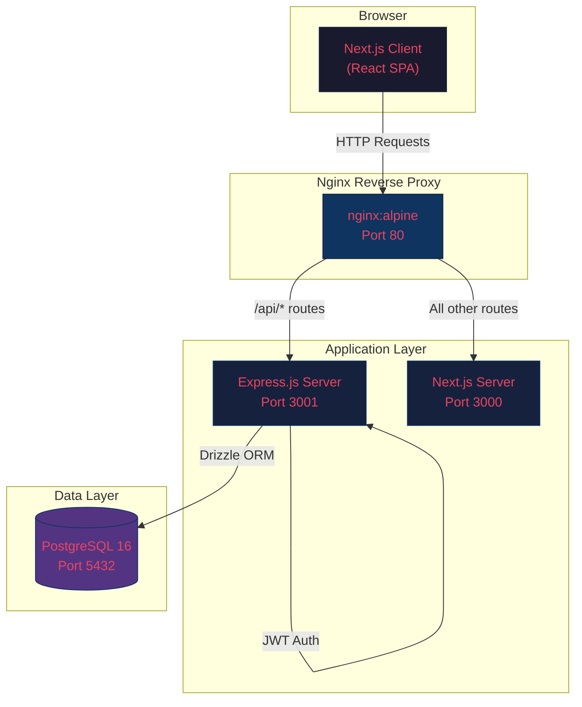

# High-Level Architecture

System overview showing how the browser, nginx reverse proxy, application servers, and database connect.

## Key Points

- **Nginx** acts as a single entry point on port 80
- `/api/*` requests are proxied to the **Express.js** backend
- All other requests (pages, assets) go to **Next.js**
- The Express server communicates with **PostgreSQL** via **Drizzle ORM**
- **JWT tokens** are used for authentication (stateless, no session store)
