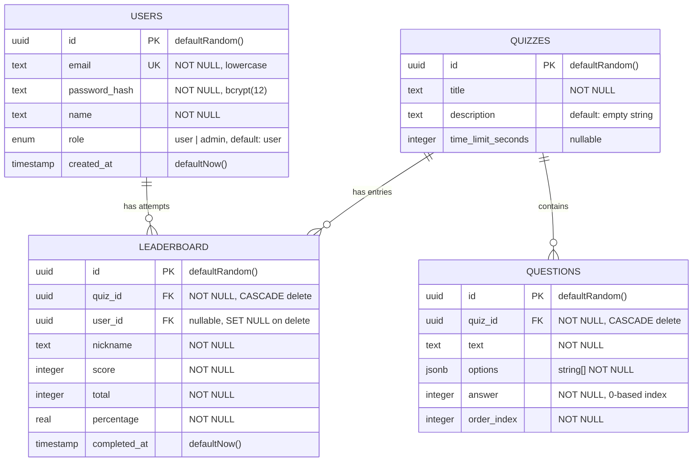

# Database Schema (ER Diagram)

Entity-relationship diagram showing all four tables, their columns, constraints, and relationships.

## Relationships

| Parent | Child | Type | On Delete |
|--------|-------|------|-----------|
| `quizzes` | `questions` | One-to-Many | **CASCADE** — deleting a quiz removes all its questions |
| `quizzes` | `leaderboard` | One-to-Many | **CASCADE** — deleting a quiz removes all leaderboard entries |
| `users` | `leaderboard` | One-to-Many | **SET NULL** — deleting a user keeps leaderboard entries but nulls `user_id` |

## Notes

- `questions.answer` is a **0-based index** into the `options` JSON array
- `questions.options` is stored as a `jsonb` column typed as `string[]`
- `leaderboard.user_id` is **nullable** — anonymous users can submit quiz results
- All primary keys use UUID v4 (`defaultRandom()`)
