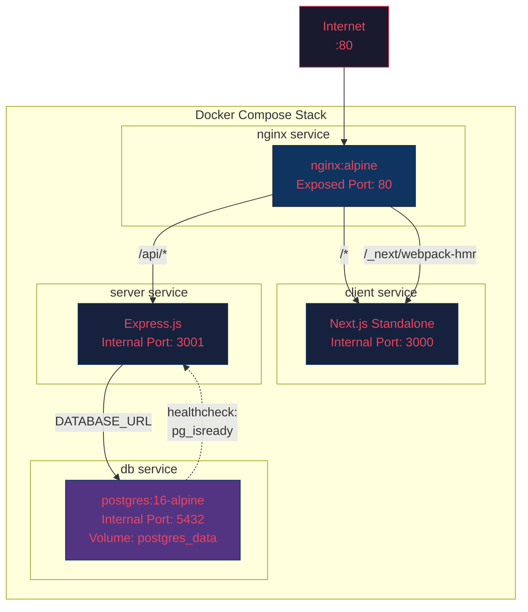
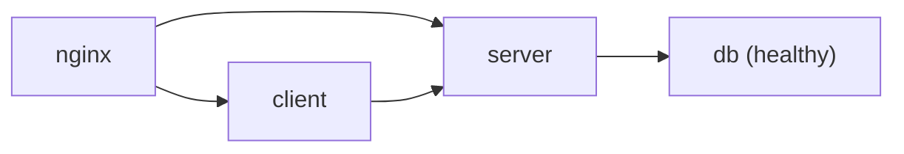
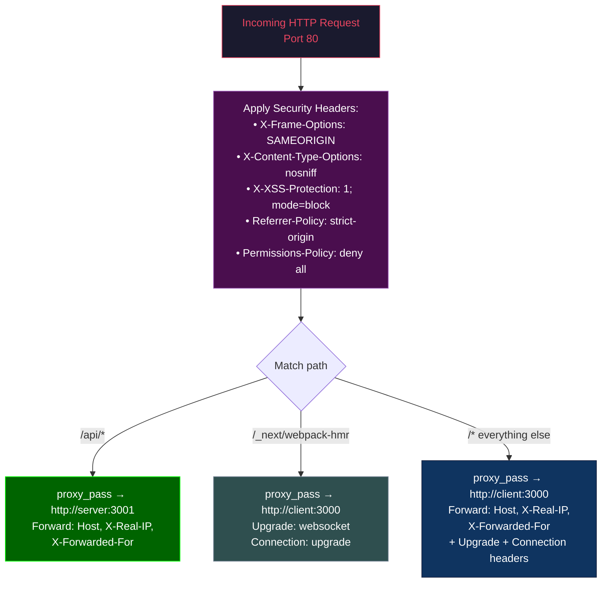

# Deployment Architecture (Docker)

## Docker Compose Stack

## Service Dependencies

- **db**: Must pass `pg_isready` healthcheck before server starts
- **server**: Depends on `db` (condition: `service_healthy`)
- **client**: Depends on `server`
- **nginx**: Depends on both `client` and `server`

## Nginx Request Routing

## Environment Variables

| Service | Variable | Purpose |
|---------|----------|---------|
| `db` | `POSTGRES_DB` | Database name (default: `tapcetdb`) |
| `db` | `POSTGRES_USER` | DB user (default: `tapcetuser`) |
| `db` | `POSTGRES_PASSWORD` | DB password (default: `tapcetpass`) |
| `server` | `DATABASE_URL` | Full Postgres connection string |
| `server` | `JWT_SECRET` | Secret key for JWT signing |
| `server` | `PORT` | Server listen port (3001) |
