# Server Startup Sequence

The Express server boot process: middleware setup → database migration → seed data → listen.

```mermaid
sequenceDiagram
    participant Process as Node.js Process
    participant Express as Express App
    participant Drizzle as Drizzle ORM
    participant DB as PostgreSQL

    Process->>Express: Create app instance
    Process->>Express: Configure CORS (dev only)
    Process->>Express: Register JSON body parser
    Process->>Express: Register logging middleware
    Process->>Express: Mount /api/auth routes
    Process->>Express: Mount /api/admin routes
    Process->>Express: Mount /api routes (quiz)
    Process->>Express: Register global error handler

    rect rgb(30, 30, 60)
        Note over Process,DB: start() — async bootstrap
        Process->>Drizzle: migrate(db, migrationsFolder)
        Drizzle->>DB: Run pending migrations
        DB-->>Drizzle: Migrations applied
        Drizzle-->>Process: Done

        Process->>DB: seed() — check quiz count
        DB-->>Process: count = 0?
        alt No quizzes exist
            Process->>DB: INSERT 3 seed quizzes + 18 questions
            DB-->>Process: Seeded
            Process->>Process: console.log("Database seeded.")
        else Quizzes already exist
            Process->>Process: Skip seeding
        end

        Process->>Express: app.listen(PORT)
        Express-->>Process: Server running on :3001
    end

    rect rgb(60, 20, 20)
        Note over Process: Error handling
        alt Startup fails
            Process->>Process: console.error("Startup failed:", err)
            Process->>Process: process.exit(1)
        end
    end
```

## Middleware Stack (in order)

1. **CORS** — Only enabled when `NODE_ENV !== "production"`, allows `CLIENT_ORIGIN` (default `http://localhost:3000`)
2. **express.json()** — Parses JSON request bodies
3. **Logging middleware** — Logs selected routes: `/api/auth/*`, `/api/admin/*`, `POST /api/quiz/:id/submit`
4. **Route handlers** — Auth → Admin → Quiz
5. **Error handler** — Catches unhandled errors, returns `500`

## Seed Data

When the database has zero quizzes, three quizzes are auto-seeded:

| Quiz | Questions | Time Limit |
|------|:---------:|:----------:|
| General Knowledge | 6 | 60s |
| Web Development | 6 | 90s |
| Science & Nature | 6 | 75s |
