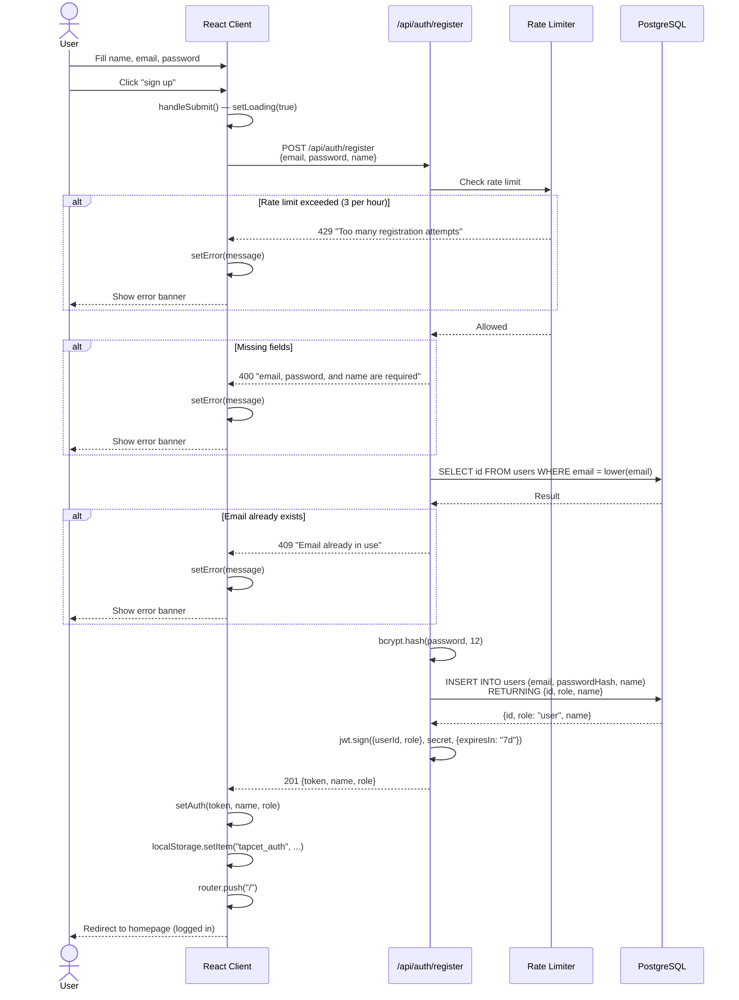

# User Registration Flow

Complete sequence from form submission to authenticated redirect.

## Validation Rules

| Field | Requirement |
|-------|-------------|
| `email` | Required, stored as lowercase |
| `password` | Required, min 8 chars (client-side), hashed with bcrypt (cost 12) |
| `name` | Required |

## Rate Limiting

- **Window**: 1 hour
- **Max attempts**: 3 per IP
- **Response**: `429 Too Many Requests`
