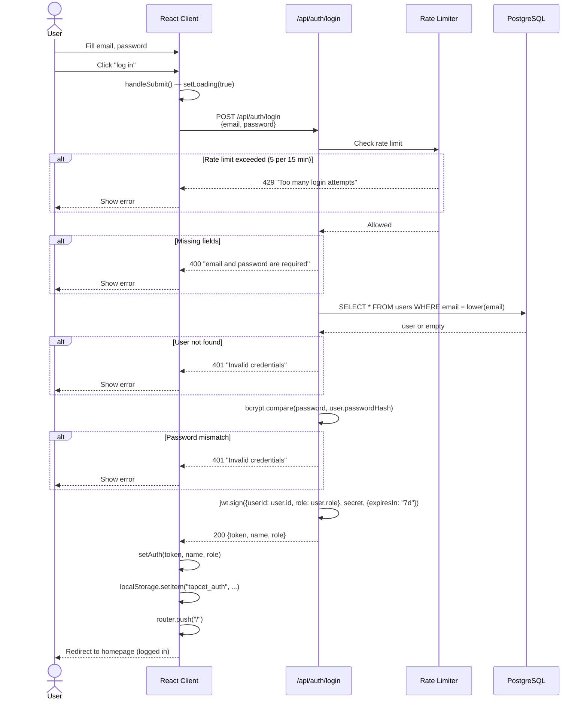

# User Login Flow

Complete sequence from form submission to authenticated redirect.

## Security Notes

- Same error message `"Invalid credentials"` for both wrong email and wrong password (prevents user enumeration)
- Passwords are never stored in plain text — only bcrypt hashes
- JWT tokens expire after **7 days**

## Rate Limiting

- **Window**: 15 minutes
- **Max attempts**: 5 per IP
- **Response**: `429 Too Many Requests`
