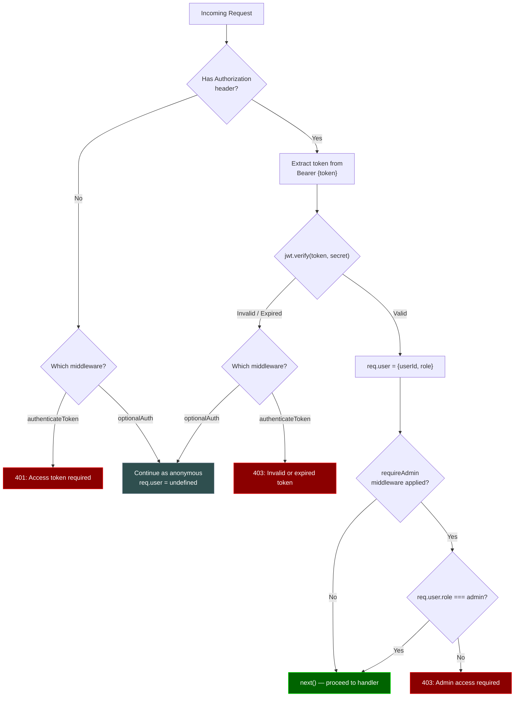

# Authentication & Authorization Middleware

How the three middleware functions (`authenticateToken`, `optionalAuth`, `requireAdmin`) validate requests.

## Decision Flowchart



## Middleware Usage by Route

| Route | Middleware | Behavior |
|-------|-----------|----------|
| `GET /api/quizzes` | None | Fully public |
| `GET /api/quiz/:id` | None | Fully public |
| `POST /api/quiz/:id/submit` | `optionalAuth` | Works for anonymous; attaches `userId` if logged in |
| `GET /api/quiz/:id/leaderboard` | None | Fully public |
| `GET /api/dashboard` | `authenticateToken` | Requires valid JWT |
| `POST /api/admin/quizzes` | `authenticateToken` + `requireAdmin` | Must be admin |
| `PUT /api/admin/quizzes/:id` | `authenticateToken` + `requireAdmin` | Must be admin |
| `DELETE /api/admin/quizzes/:id` | `authenticateToken` + `requireAdmin` | Must be admin |

## JWT Payload Structure

```json
{
  "userId": "uuid-string",
  "role": "user | admin",
  "iat": 1234567890,
  "exp": 1235172690
}
```

- **Signing algorithm**: HS256 (default)
- **Expiry**: 7 days
- **Secret**: Read from `JWT_SECRET` environment variable
