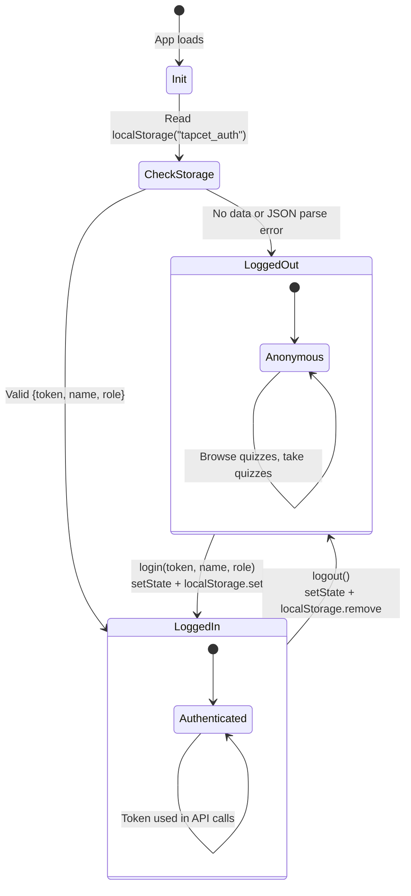

# Client-Side Auth Context Lifecycle

How authentication state is managed in the React client using Context API + localStorage.

## State Diagram



## How It Works

### Initialization (on page load)
1. Check if `typeof window === "undefined"` (SSR guard)
2. Read `localStorage.getItem("tapcet_auth")`
3. If found, `JSON.parse()` into `{token, name, role}`
4. If parse fails, remove corrupted data from localStorage

### Login
1. Called after successful `/api/auth/login` or `/api/auth/register`
2. Updates React state with `{token, name, role}`
3. Persists to `localStorage.setItem("tapcet_auth", JSON.stringify(...))`

### Logout
1. Clears React state to `{token: null, name: null, role: null}`
2. Removes `localStorage.removeItem("tapcet_auth")`

## Auth State Shape

```typescript
interface AuthState {
  token: string | null;    // JWT token string
  name: string | null;     // User display name
  role: "user" | "admin" | null;  // User role
}
```

## Consumer Usage

```typescript
const { token, name, role, login, logout } = useAuth();
```

All components wrapped in `<AuthProvider>` can access auth state via the `useAuth()` hook.
