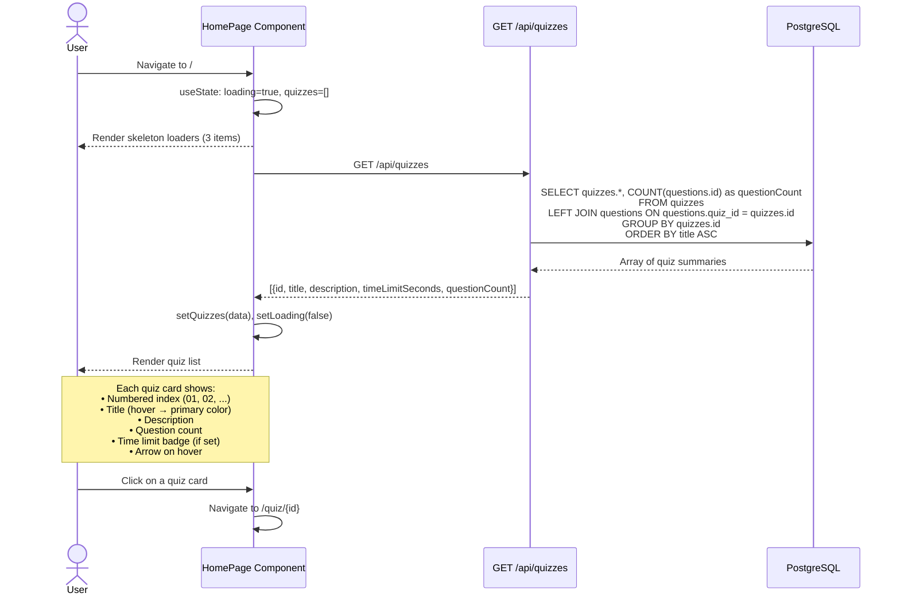

# Homepage — Browse Quizzes

Loading and displaying the quiz listing on the homepage.

## UI States

| State | Display |
|-------|---------|
| Loading | 3 skeleton placeholders |
| Error | Red error message |
| Empty | "No quizzes yet. Check back soon." |
| Loaded | Numbered list of quiz cards |
