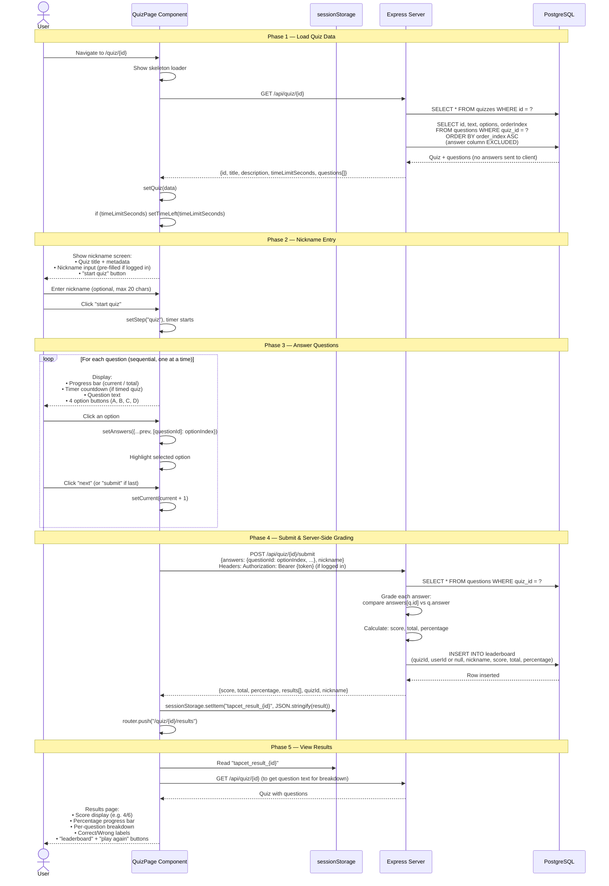

# Quiz Taking — Full End-to-End Sequence

The complete flow from opening a quiz to seeing results, covering all 5 phases.

## Key Design Decisions

1. **Answers are never sent to the client** — the `GET /api/quiz/:id` endpoint excludes the `answer` column from questions
2. **Grading is server-side only** — prevents cheating by inspecting client code
3. **Results are stored in sessionStorage** — allows the results page to display without another API call; data is lost on tab close (by design)
4. **Optional auth on submit** — both logged-in users and anonymous users can take quizzes; logged-in users get their attempt linked to their account
