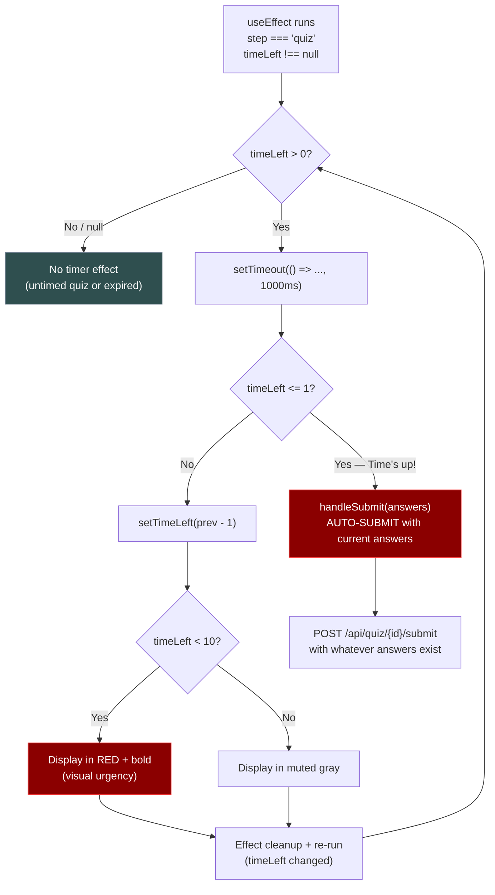

# Quiz Timer Logic (Client-side)

How the countdown timer works during a timed quiz.

## Behavior Summary

| Condition | Behavior |
|-----------|----------|
| `timeLimitSeconds` is `null` | No timer shown, no auto-submit |
| `timeLeft > 10` | Timer shown in muted gray |
| `timeLeft < 10` | Timer shown in **red + bold** (urgency) |
| `timeLeft` reaches `0` | Quiz auto-submits with current answers |
| User submits before timeout | Timer is irrelevant, normal submit |

## Implementation Notes

- Timer only runs when `step === "quiz"` (not during nickname entry)
- Uses `setTimeout` with cleanup (`clearTimeout`) to avoid memory leaks
- The `handleSubmit` function is wrapped in `useCallback` to stay stable across re-renders
- If a user hasn't answered some questions when time expires, those questions get `-1` as the selected answer (always wrong)
