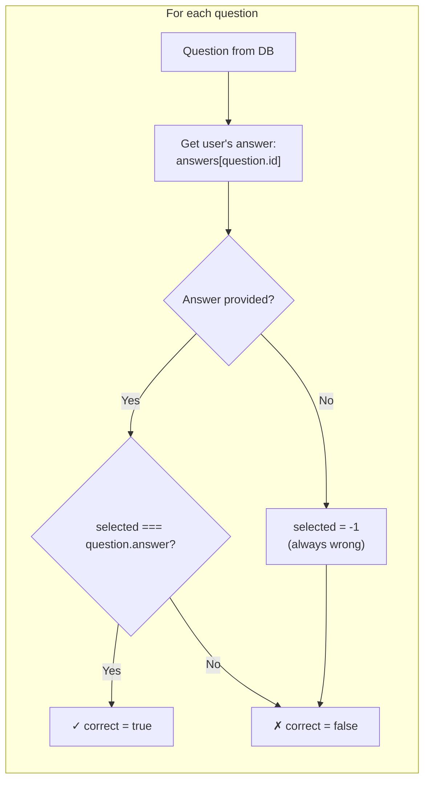

# Quiz Submission & Server-Side Grading

Detailed look at how answers are graded on the server.

```mermaid
sequenceDiagram
    participant Client
    participant Middleware as optionalAuth
    participant Handler as POST /quiz/:id/submit
    participant DB as PostgreSQL

    Client->>Middleware: POST /api/quiz/{id}/submit<br/>{answers: {questionId: optionIndex}, nickname}

    Middleware->>Middleware: Check Authorization header
    alt Has valid JWT
        Middleware->>Middleware: req.user = {userId, role}
    else No token or invalid
        Middleware->>Middleware: req.user = undefined (anonymous)
    end
    Middleware->>Handler: next()

    alt answers missing or not an object
        Handler-->>Client: 400 "answers object is required"
    end

    Handler->>DB: SELECT * FROM quizzes WHERE id = ?
    alt Quiz not found
        Handler-->>Client: 404 "Quiz not found"
    end

    Handler->>DB: SELECT * FROM questions<br/>WHERE quiz_id = ?<br/>ORDER BY order_index ASC
    DB-->>Handler: questions[]

    rect rgb(20, 40, 20)
        Note over Handler: Grading Logic
        Handler->>Handler: For each question:<br/>  selected = answers[q.id] ?? -1<br/>  correct = (selected === q.answer)
        Handler->>Handler: score = results.filter(r => r.correct).length
        Handler->>Handler: total = questions.length
        Handler->>Handler: percentage = total > 0 ? (score / total) * 100 : 0
        Handler->>Handler: nickname = input.trim().slice(0, 20) || "Anonymous"
    end

    Handler->>DB: INSERT INTO leaderboard<br/>(quizId, userId or null, nickname, score, total, percentage)
    DB-->>Handler: Row inserted

    Handler-->>Client: 200 {score, total, percentage, results[], quizId, nickname}
```



## Grading Logic Detail



## Response Shape

```typescript
{
  score: number;        // Count of correct answers
  total: number;        // Total questions in quiz
  percentage: number;   // (score / total) * 100
  quizId: string;       // Quiz UUID
  nickname: string;     // Display name used
  results: [
    {
      questionId: string;
      correct: boolean;
      selectedAnswer: number;   // User's pick (0-based, or -1 if unanswered)
      correctAnswer: number;    // Correct option index (0-based)
    }
  ]
}
```
