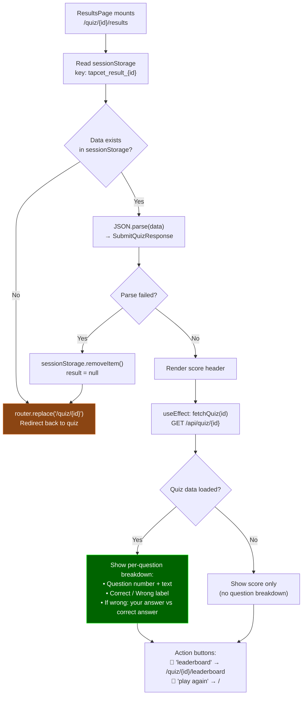

# Results Page — Read from Session Storage

How the results page loads and displays quiz results.

## What the Results Page Shows

1. **Score header**: Large score number (e.g., `4 / 6`), percentage progress bar
2. **Submitted as**: Displays the nickname used
3. **Question breakdown** (if quiz data loads):
   - Each question with correct/wrong status
   - For wrong answers: shows user's pick and the correct answer
4. **Action buttons**: View leaderboard or play another quiz

## Why sessionStorage?

- Results are stored client-side in `sessionStorage` after the submit API call
- This avoids needing another API endpoint to fetch individual results
- `sessionStorage` data is **lost when the tab closes** — this is intentional (results are ephemeral, leaderboard is permanent)
- If someone navigates to `/quiz/{id}/results` directly without data, they're redirected back to the quiz
