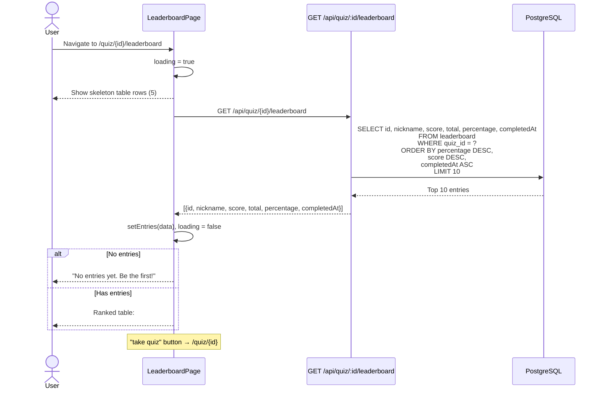

# Leaderboard Retrieval

How the top 10 leaderboard is fetched and displayed.

## Sorting Logic

Entries are ranked by three criteria (in order):

1. **Percentage** — highest first (`DESC`)
2. **Score** — highest first (`DESC`) — breaks ties when percentage is equal
3. **Completed at** — earliest first (`ASC`) — first to achieve the score ranks higher

## Display

| Column | Example |
|--------|---------|
| Rank | `01`, `02`, ... |
| Nickname | `Alice` |
| Score | `5/6` |
| Percentage | `83%` |
