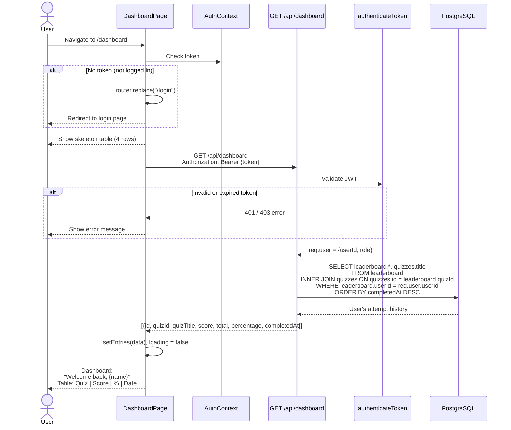

# Dashboard — User Attempt History

How a logged-in user views their quiz attempt history.

## Display Details

- **Header**: "Welcome back, {name}." with user's display name
- **Table columns**: Quiz (links to leaderboard), Score (`4/6`), Percentage (`67%`), Date
- **Empty state**: "No attempts yet. Take a quiz" with link to homepage
- **Percentage color**: Green (`text-primary`) if ≥ 60%, muted if < 60%
- **Ordering**: Most recent attempts first

## Auth Guard

The dashboard has a **client-side auth guard**:
1. If `token` is `null`, immediately redirect to `/login`
2. Render `null` during redirect to prevent flash of content
