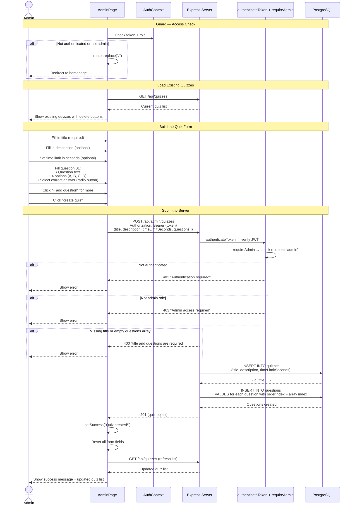
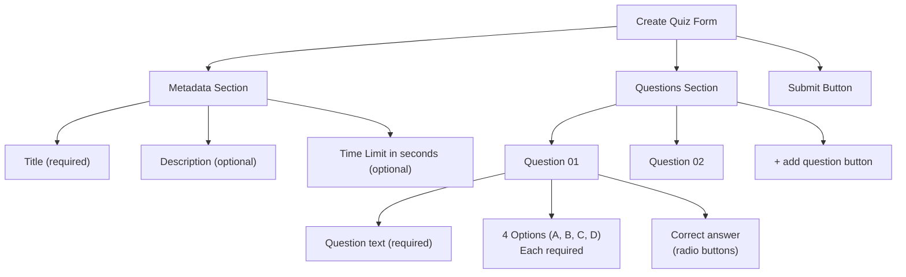

# Admin — Create Quiz

How an admin user creates a new quiz with questions.

## Form Structure

## Notes

- Questions always have exactly 4 options
- The correct answer is stored as a 0-based index
- `orderIndex` is automatically assigned based on array position
- After successful creation, the form resets and the quiz list refreshes
