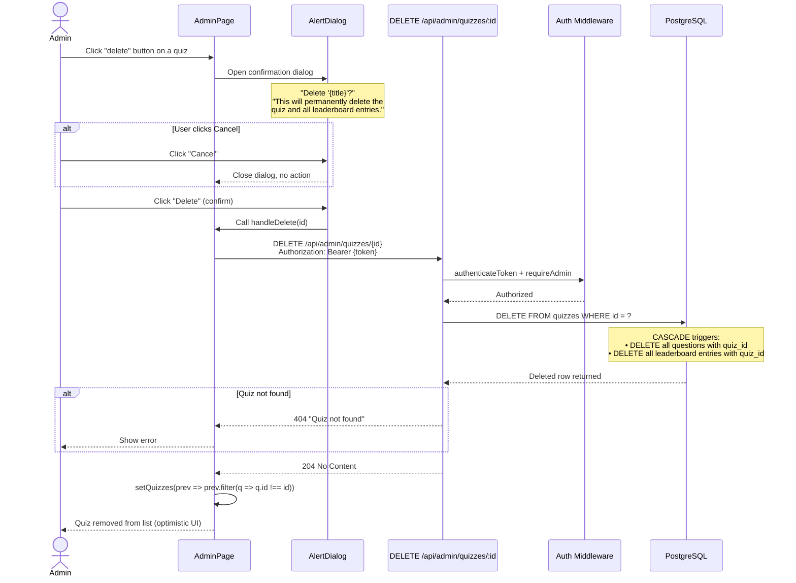
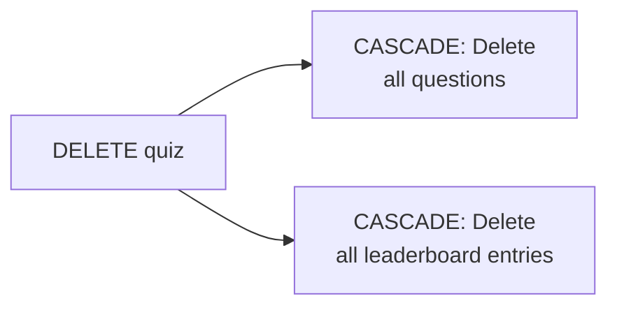

# Admin — Delete Quiz

How an admin deletes a quiz with confirmation dialog.

## Cascade Behavior

When a quiz is deleted, PostgreSQL automatically deletes related rows:

This is defined by the foreign key constraints:
- `questions.quiz_id` → `ON DELETE CASCADE`
- `leaderboard.quiz_id` → `ON DELETE CASCADE`

## Confirmation Dialog

The deletion uses an `AlertDialog` component to prevent accidental deletions:
- **Title**: `Delete "{quiz title}"?`
- **Description**: Warns about permanent deletion including leaderboard entries
- **Actions**: Cancel (close) or Delete (proceed)
