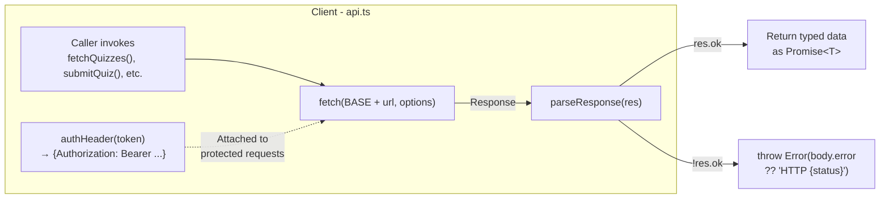
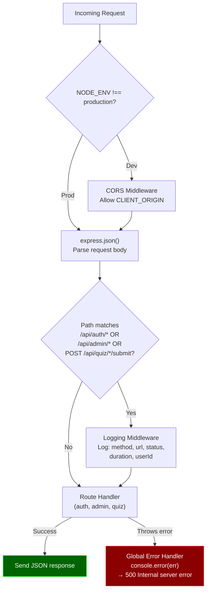

# API Layer — Request/Response Pipeline

How requests flow through the client API layer and server middleware stack.

## Client-Side API Layer

## Server-Side Middleware Stack

## Client API Functions

| Function | Method | Endpoint | Auth |
|----------|--------|----------|:----:|
| `fetchQuizzes()` | GET | `/api/quizzes` | ✗ |
| `fetchQuiz(id)` | GET | `/api/quiz/{id}` | ✗ |
| `submitQuiz(id, answers, nickname, token)` | POST | `/api/quiz/{id}/submit` | Optional |
| `fetchLeaderboard(id)` | GET | `/api/quiz/{id}/leaderboard` | ✗ |
| `fetchDashboard(token)` | GET | `/api/dashboard` | Required |
| `login(email, password)` | POST | `/api/auth/login` | ✗ |
| `register(email, password, name)` | POST | `/api/auth/register` | ✗ |

## Error Handling Pattern

All client API calls use the same `parseResponse<T>()` helper:

1. Check `res.ok` (status 200-299)
2. If not OK: parse body for `.error` message, throw `Error`
3. If OK: return `res.json()` typed as `T`

This means all API errors surface as thrown `Error` objects with meaningful messages from the server.
